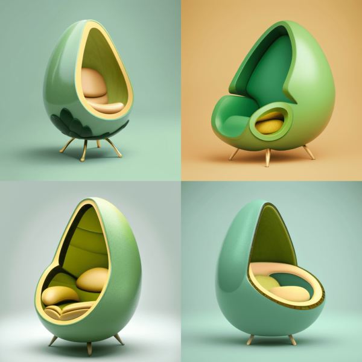
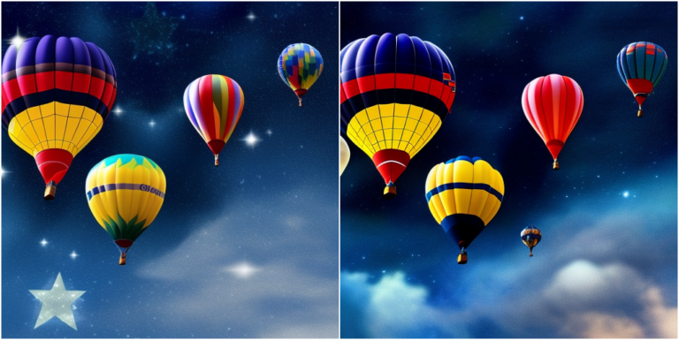
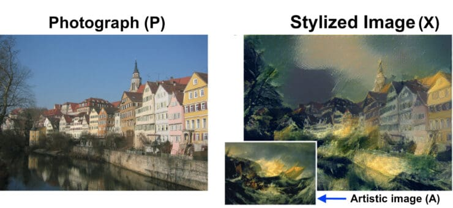
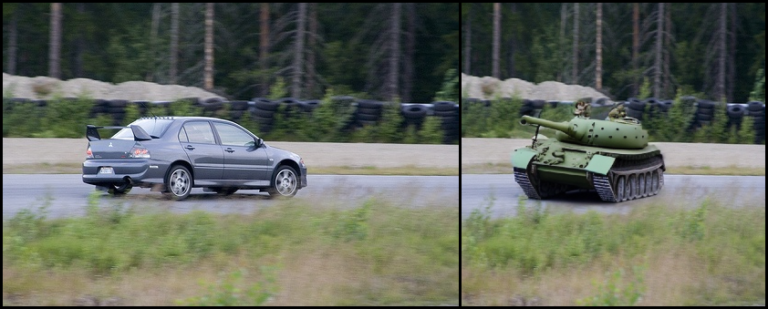
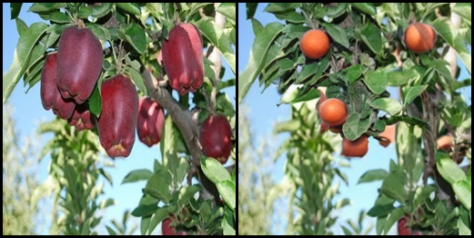

# Applications of Diffusion Models

## Text to Image

As the name suggests, we can use diffusion models to generate high-quality images with realistic textures and details based on textual prompts. Diffusion Models can generate diverse images for a given textual description, providing a range of possible visual interpretations.

"Avocado chair" using Midjourney version v4

## Textual Inversion

Using textual inversion, we can finetune a diffusion model to generate images using personal objects or artistic styles using as few as 10 images. This is not an application per se but a clever trick to train diffusion models that one can use to generate more personalized images.

If you aren't looking for anything too personal and want to generate images using some known styles, you can try out the [Stable Diffusion Conceptualizer space](https://huggingface.co/spaces/sd-concepts-library/stable-diffusion-conceptualizer). Here you'll find a collection of diffusion models trained in different artistic styles. You can choose anyone to your liking and start generating without any hassle. You can choose any to your liking and start generating without hassle.

## Text to Videos

As the name suggests, we can use diffusion models to directly generate videos with the help of text prompts. Extending the concept used in text-to-image to videos, one can use diffusion models to generate videos from stories, songs, poems, etc.

[diffusion-models_application_text_to_video_deforum_example.webm](https://user-images.githubusercontent.com/57580923/231758620-2cfa7e45-a232-4243-a184-05637e77b191.webm)

a beautiful forest by Asher Brown Durand, trending on Artstation

## Text to 3D

This application was showcased in the "Dreamfusion" paper, where the authors, with the help of "NeRFs," could use a trained 2D text-to-image diffusion model to perform text-to-3D synthesis.

## Text to Motion

This is another upcoming and exciting application where diffusion models (along with other techniques) are used to generate simple human motion.

## Image to Image

Image-to-image (Img2Img for short) is a method we can use to modify existing images. It is a technique to transform an existing image to a target domain using the text prompt. Simply put, we can generate a new image with the same content as an existing image but with some transformations. We can provide the textual description of the transformation we want.

L – "air balloons, balloon festival, dark sky, bright stars, award-winning, 4k. Hd"  
R – "Pixar, Disney pictures, air balloons, balloon festival, dark sky, bright stars, award-winning, 4k. Hd"

A use-case of Img2Img is Style Tranfer. In Style transfer, we take two images: one for content and one for style reference. A new image is generated that is a mixture of both: the first’s content in another’s style.

## Image Inpainting

Image Inpainting is an image restoration technique to remove unwanted objects in an image or replace them with some other object/texture/design entirely. To perform image inpainting, the user first draws a mask around the object or the pixels that need to be altered. After creating the mask, the user can tell the model how it should alter the masked pixels.

Some examples:

## Image Outpainting

Outpainting or infinity painting is a process in which the diffusion model adds details outside/beyond the original image. We can extend our original image by either utilizing parts of the original image (or newly generated pixels) as reference pixels or by adding new textures and concepts using the text prompt.

## Infinite Zoom In & Zoom Out

### Infinite Zoom In

The process used to generate an "Infine zoom in" is as follows:

1. Generate an image using the Stable Diffusion model.
2. Scale the image down and copy-paste it into the center.
3. Mask out a boundary outside the small copy.
4. Use Stable Diffusion inpainting to fill in the masked part.

### Infinite Zoom Out

The methods used to generate "Infine Zoom Out" is pretty easy to grasp. It can be considered as an extension of "outpainting." Unlike image outpainting, the image size stays constant throughout the process.

The size of the image generated using the initial prompt is gradually decreased. This creates a blank space between the image border and the resized image. The additional space is filled using the diffusion model conditioned on the same prompt with the new image (containing the blank space and the initial image) as an initial point. We can generate a video by continuing this process for some iterations, as shown in the examples above.

## References

1. [Introduction to Diffusion Models for Image Generation – A Comprehensive Guide](https://learnopencv.com/image-generation-using-diffusion-models/)
