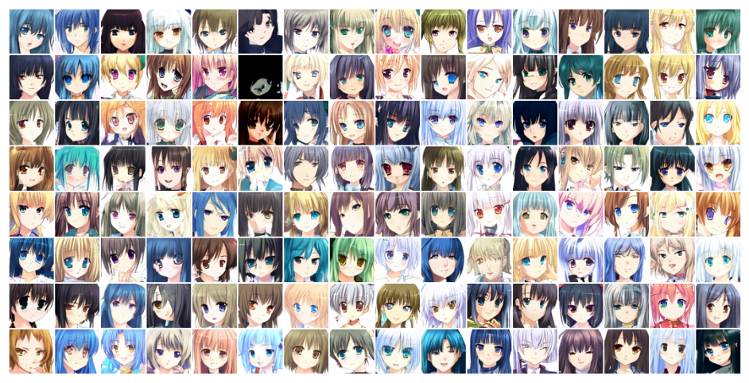
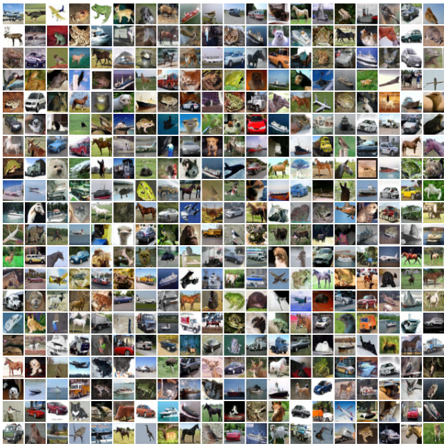

# Denoising Diffusion Probabilistic Model

Diffusion probabilistic models are an exciting new area of research showing great promise in image generation. In retrospect, diffusion-based generative models were first introduced in 2015 and popularized in 2020 when Ho et al. published the paper ["Denoising Diffusion Probabilistic Models" (DDPMs)](https://arxiv.org/abs/2006.11239).

DDPM is a state-of-the-art generative model that has been shown to produce high-quality images with realistic textures and details. It has applications in image and video generation, as well as image and video restoration.

Diffusion generative models are composed of two opposite processes i.e., **Forward & Reverse Diffusion Process**.

**Inference**:

[inference.webm](https://user-images.githubusercontent.com/57580923/230726862-7a1fb188-1c50-4551-8da4-e5dbf6ffbd58.webm)

## Forward Diffusion Process

1. In the "Forward Diffusion" process, we slowly and iteratively add noise to (corrupt) the images in our training set such that they "move out or move away" from their existing subspace.
2. What we are doing here is converting the unknown and complex distribution that our training set belongs to into one that is easy for us to sample a (data) point from and understand.
3. At the end of the forward process, the *images become entirely unrecognizable*. The complex data distribution is wholly transformed into a (chosen) simple distribution. Each image gets mapped to a space outside the data subspace.

## Reverse Diffusion Process

1. In the "Reverse Diffusion process", the idea is to reverse the forward diffusion process.
2. We slowly and iteratively try to reverse the corruption performed on images in the forward process.
3. The reverse process starts where the forward process ends.
4. The benefit of starting from a simple space is that we know how to get/sample a point from this simple distribution (think of it as any point outside the data subspace).
5. And our goal here is to figure out how to return to the data subspace.
6. However, the problem is that we can take infinite paths starting from a point in this "simple" space, but only a fraction of them will take us to the "data" subspace.
7. In diffusion probabilistic models, this is done by referring to the small iterative steps taken during the forward diffusion process.
8. The PDF that satisfies the corrupted images in the forward process differs slightly at each step.
9. Hence, in the reverse process, we use a deep-learning model at each step to predict the PDF parameters of the forward process.
10. And once we train the model, we can start from any point in the simple space and use the model to iteratively take steps to lead us back to the data subspace.
11. In reverse diffusion, we iteratively perform the **"denoising"** in small steps, starting from a noisy image.
12. This approach for training and generating new samples is much more stable than GANs and better than previous approaches like variational autoencoders (VAE) and normalizing flows.

Since their introduction in 2020, DDPMs have been the foundation for cutting-edge image generation systems, including [DALL-E 2](https://openai.com/product/dall-e-2), [Imagen](https://imagen.research.google/), [Stable Diffusion](https://github.com/Stability-AI/stablediffusion), and [Midjourney](https://midjourney.com/).

## Model Architecture

In DDPMs, the authors use a UNet-shaped deep neural network which takes in as input:

1. The input image at any stage of the reverse process.
2. The timestep of the input image.

From the usual UNet architecture, the authors replaced the original double convolution at each level with “Residual blocks” used in ResNet models.

**The architecture comprises 5 components:**

1. Encoder blocks
2. Bottleneck blocks
3. Decoder blocks
4. Self attention modules
5. Sinusoidal time embeddings

**Architecture Details:**

1. There are four levels in the encoder and decoder path with bottleneck blocks between them.
2. Each encoder stage comprises two residual blocks with convolutional downsampling except the last level.
3. Each corresponding decoder stage comprises three residual blocks and uses 2x nearest neighbors with convolutions to upsample the input from the previous level.
4. Each stage in the encoder path is connected to the decoder path with the help of skip connections.
5. The model uses “Self-Attention” modules at a single feature map resolution.
6. Every residual block in the model gets the inputs from the previous layer (and others in the decoder path) and the embedding of the current timestep. The timestep embedding informs the model of the input’s current position in the Markov chain.

## Experiments

**Note**:

1. For good results, the model should be trained over at least 10M samples
2. Higher resolution setups are more likely to provide better results

The Kaggle notebook for experiments can be found [here](https://www.kaggle.com/code/binh234/denoising-diffusion-probabilistic-model)

### [Flowers](https://www.kaggle.com/datasets/alxmamaev/flowers-recognition/versions/2)

**32x32**:

### [Animal 10](https://www.kaggle.com/datasets/alessiocorrado99/animals10)

**32x32**:

### [Anime Face](https://www.kaggle.com/datasets/splcher/animefacedataset/versions/3)

**32x32**:

### [Anime Face 128](https://www.kaggle.com/datasets/splcher/animefacedataset/versions/3)

**32x32**:

**64x64** (this version only trained on 1.8 million samples, just for experiment purposes):

### [Cifar10](https://www.cs.toronto.edu/~kriz/cifar.html) (Paper)

**32x32**:

### [CelebA-HQ](https://www.kaggle.com/datasets/lamsimon/celebahq) (Paper)

**256x256**:

### [LSUN-Bedroom](https://www.yf.io/p/lsun) (Paper)

**256x256**:

## References

1. [Denoising Diffusion Probabilistic Model Notebook](https://www.kaggle.com/code/binh234/denoising-diffusion-probabilistic-model)
2. [An In-Depth Guide to Denoising Diffusion Probabilistic Models – From Theory to Implementation](https://learnopencv.com/denoising-diffusion-probabilistic-models/#modified-forward-diffusion-kernel)
3. [Denoising Diffusion Probabilistic Models](https://arxiv.org/abs/2006.11239)
4. [DALL-E 2](https://openai.com/product/dall-e-2)
5. [Imagen](https://imagen.research.google/)
6. [Stable Diffusion](https://github.com/Stability-AI/stablediffusion)
7. [Midjourney](https://midjourney.com/)
