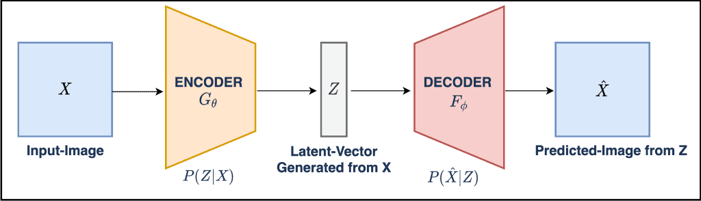
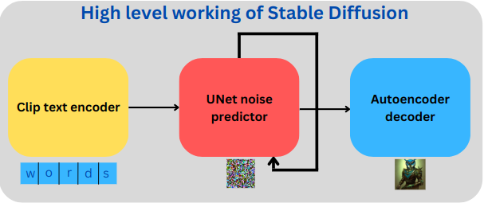
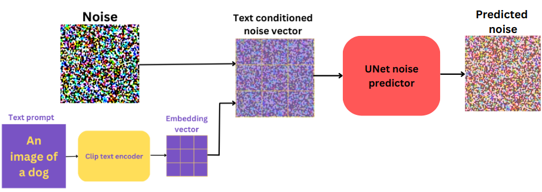
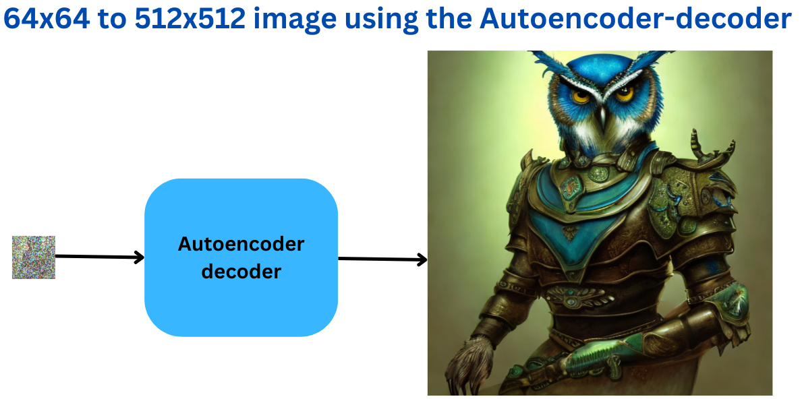
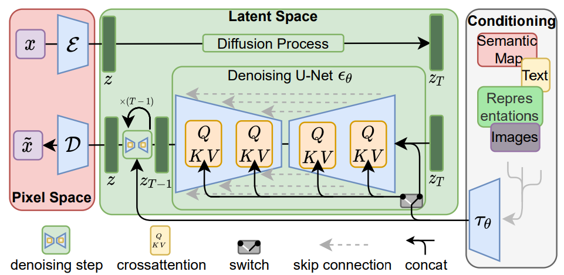
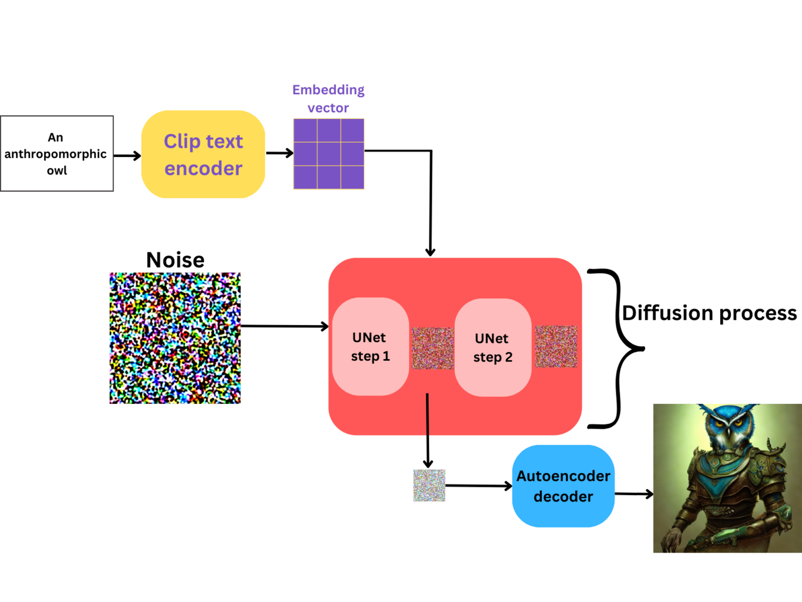
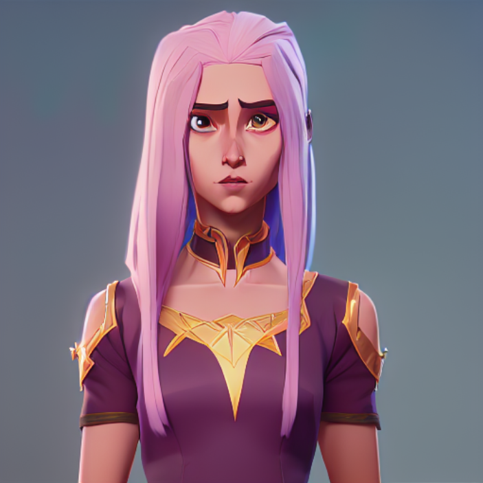
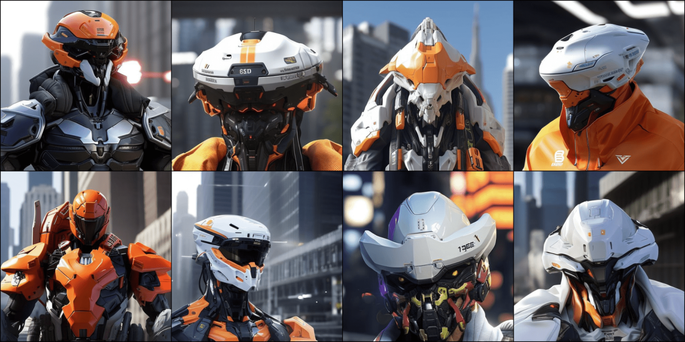
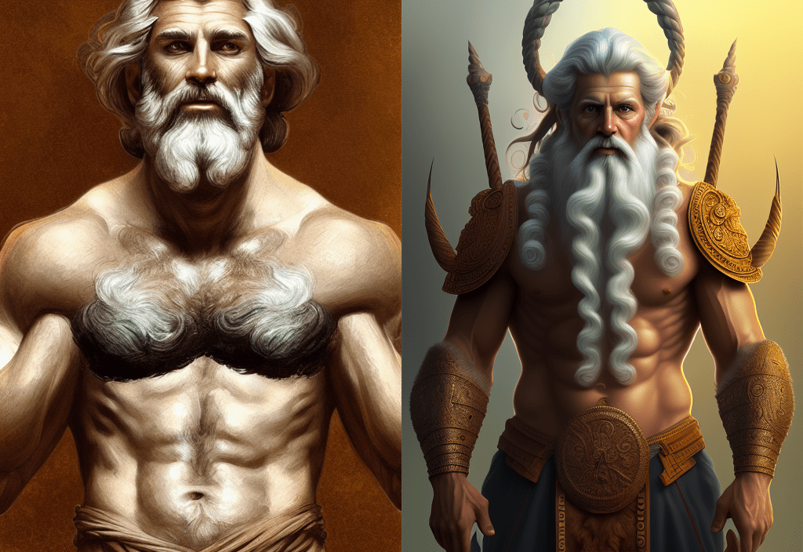
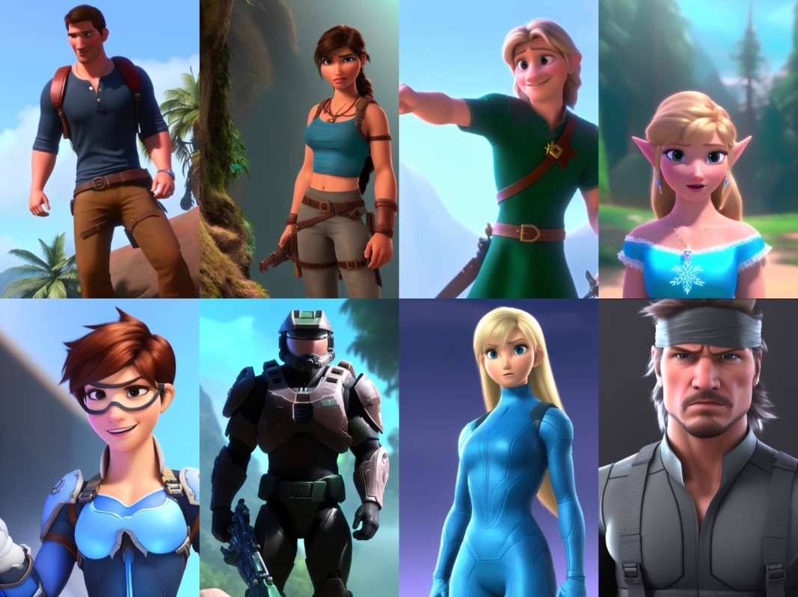

# Stable Diffusion - A New Paradigm in Generative AI

Diffusion models are now the go-to models for generating images. As diffusion models allow us to condition image generation with prompts, we can create images of our choice. Stable Diffusion is the most famous because of its open-source nature.

## Table of Contents

- [Stable Diffusion - A New Paradigm in Generative AI](#stable-diffusion---a-new-paradigm-in-generative-ai)
  - [Table of Contents](#table-of-contents)
  - [What is Stable Diffusion?](#what-is-stable-diffusion)
  - [Architecture](#architecture)
    - [Training stable diffusion](#training-stable-diffusion)
    - [Text encoder](#text-encoder)
    - [UNet Noise Predictor](#unet-noise-predictor)
    - [Autoencoder-Decoder Model](#autoencoder-decoder-model)
  - [The Entire Process of Training Stable Diffusion](#the-entire-process-of-training-stable-diffusion)
  - [Inference](#inference)
  - [Different Versions of Stable Diffusion](#different-versions-of-stable-diffusion)
  - [Variations of Stable Diffusion](#variations-of-stable-diffusion)
    - [Arcane Diffusion](#arcane-diffusion)
    - [Robo Diffusion](#robo-diffusion)
    - [Open Journey](#open-journey)
    - [Mo Di Diffusion](#mo-di-diffusion)
  - [References](#references)

## What is Stable Diffusion?

Originating from the Latent Diffusion Model (LDM), which was the original text-to-image model, Stable Diffusion is an extension. This means that Stable Diffusion is also a **text-to-image** model.

Stable Diffusion works on the latent space rather than on the pixel space of images. Other generative diffusion models like [DALL-E 2](https://openai.com/product/dall-e-2) and [Imagen](https://imagen.research.google/) work on the pixel space. This makes them slower and, in the process, consumes more memory.

An Autoencoder model helps create this latent space which also works as the noise predictor in the model.

## Architecture

Stable Diffusion model contains three primary components:

1. A pre-trained text encoder
2. A UNet noise predictor
3. A Variational autoencoder-decoder model. The decoder also contains an Upsampler network to generate the final high-resolution image.

But all the components are involved during both training and inference. During training, the encoder-decoder, UNet, and pre-trained text encoder are used. While during the inference, the pre-trained text encoder, the UNet, and the decoder are involved.

High level speaking, a pre-trained text encoder converts the text prompt into embeddings.

The UNet model acts on the latent space information from the image conditioned by text embeddings as the noise predictor.

The autoencoder-decoder has two tasks. The encoder generates the latent space information from the original image pixels and the decoder predicts the final image from the text-conditioned latent space.

### Training stable diffusion

Training a Stable Diffusion model involves four stages:

1. Create the token embeddings from the prompt. From a training perspective, we will call the text prompt the **caption**.
2. Generate the latent space from the original image using the encoder part of the autoencoder model. The latent space will then go through a Diffusion process to generate the noisy image.
3. Pass the noisy image to the UNet conditioned by the text embeddings. This is called text-conditioned latent space.
4. The UNet entirely works on the latent space. The UNet predicts the noise added to the latent space and tries to denoise it.

### Text encoder

Generally, in all diffusion models, the text encoder is a **large pretrained transformer language model**. Stable Diffusion uses the pre-trained text encoder part of [CLIP](https://github.com/openai/CLIP) for text encoding.

*Other pre-trained language transformers models like T5 and BERT may also be used. But Stable Diffusion uses CLIP.*

### UNet Noise Predictor

Before the UNet, the encoder part of the autoencoder-decoder model converts the input image into its **latent representation**.

Now, it's important to remember that the UNet acts exclusively on the latent space and does not deal with the original image pixels. It is, of course, conditioned by the text caption. The process of adding the caption information to the latent space called **text conditioning**. Besides text conditioning, we can also condition the same latent space with semantic maps or other images.

Not just text conditioning, the latent information also goes through a noise addition step called diffusion process, as discussed above.

After that, the UNet tries to predict the noise added to the image.

The UNet outputs a 64×64 (spatial) dimensional tensor.

### Autoencoder-Decoder Model

As previously discussed, the encoder part of the autoencoder model creates the latent space from the original image.

Finally, the decoder part of the model is responsible for generating the final image:

The decoder acts on a 4x64x64 dimensional vector and generates a 3x512x512 image. The original Stable Diffusion model (till version 2.0) will generate a 512×512 dimensional image by default.

## The Entire Process of Training Stable Diffusion

The entire process can be summarized in the following image:

You can see how first the encoder encodes the image into a latent space (top part right red block). And notice how we can condition the latent space with either text, semantic map, or even images.

The **QKV** blocks represent the cross-attention from the Transformer model. The big green block shows the working of the UNet on the latent space to predict the noise.

## Inference

During inference, we don't have an image with us initially. Instead, we have to generate one using a text prompt. Also, we do not need the encoder part of the autoencoder-decoder network. This boils down the inference components to the following:

- The pretrained text encoder.
- The UNet noise predictor.
- And the decoder part of the autoencoder-decoder network.

Instead of adding noise to an image, we start directly with pure Gaussian noise. The Stable Diffusion model then iteratively denoises it to generate the final image. We can control the number of denoising steps called **sampling steps**.

## Different Versions of Stable Diffusion

Stable Diffusion was initially introduced as version 1.4 by CompVis and RunwayML, followed by version 1.5 by RunwayML. The current owner, [StabilityAI](https://github.com/Stability-AI/stablediffusion), maintains the latest iterations, Stable Diffusion 2.0 and 2.1. These are the official versions of Stable Diffusion. In addition, there are numerous finely tuned Stable Diffusion models that can produce images in specific art styles. We will delve into them further in the upcoming section.

## Variations of Stable Diffusion

Code for this section is available in `Diffusion_Models_Variations.ipynb`

### Arcane Diffusion

This variation of Stable Diffusion has been fine-tuned on images from the TV show Arcane.

### Robo Diffusion

The Robo Diffusion version of Stable Diffusion can generate stunning images of robots.

### Open Journey

The Openjourney model can generate images in the style of [Midjourney](https://midjourney.com/).

### Mo Di Diffusion

The Mo Di Diffusion model adds Disney art style to any image that we create.

## References

1. [Stable Diffusion](https://github.com/Stability-AI/stablediffusion)
2. [OpenCV blog](https://learnopencv.com/stable-diffusion-generative-ai/)
3. [DALL-E 2](https://openai.com/product/dall-e-2)
4. [Imagen](https://imagen.research.google/)
5. [Midjourney](https://midjourney.com/)
6. [CLIP](https://github.com/openai/CLIP)
