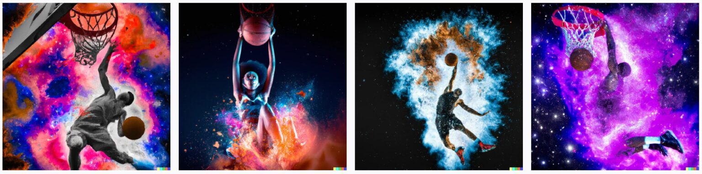

# DALL·E 2: A Breakthrough in AI Art Generation

DALL·E 2 is a cutting-edge technology developed by OpenAI that has taken the world of image generation by storm. It is a remarkable breakthrough in the AI field, enabling users to generate high-quality images with unprecedented levels of detail and complexity.

DALL·E 2 is built on the foundation of GPT-3, one of the most advanced language models in the world, and has been trained on an enormous dataset of images, allowing it to generate stunningly realistic and diverse images.

DALL·E 2 showcases:

## Table of Contents

- [DALL·E 2: A Breakthrough in AI Art Generation](#dalle-2-a-breakthrough-in-ai-art-generation)
  - [Table of Contents](#table-of-contents)
  - [What is DALL·E 2?](#what-is-dalle-2)
  - [DALL·E 2 Features](#dalle-2-features)
    - [Generate Images](#generate-images)
    - [Inpainting](#inpainting)
    - [Out Painting](#out-painting)
    - [Generate Image Variations](#generate-image-variations)
  - [How does it work?](#how-does-it-work)
  - [References](#references)

## What is DALL·E 2?

DALL-E 2 is the 2nd generation of the diffusion model that uses the diffusion process to fuse multiple visual concepts to create novel images. It was released by OpenAI in April 2022.

Researchers at OpenAI managed to increase the model performance as it creates more realistic images at 1024×1024 pixels.

## DALL·E 2 Features

### Generate Images

The quality of the image produced by the DALL E 2 image generator directly depends on how well you ask it. Here are two examples.

Prompt: a basketball player dunking

Prompt: An expressive photograph of a basketball player dunking in hoop, depicted as an explosion of a nebula

To get what you want, be as detailed as possible in your prompts. This gives the model more information to work with. A well-detailed prompt is needed if we want to merge multiple visual concepts together.

### Inpainting

For editing, you have to mask the area of the image you want to change and give it a prompt to generate a replacement image to put in that place. All the previous rules of crafting a prompt still apply.

### Out Painting

Out painting is another feature added later to their image editing tool by OpenAI. It is conceptually similar to inpainting, where you specify an area and generates a new image to merge it with the existing one. But it works outside the chosen image instead of editing a part inside of the original image.

### Generate Image Variations

Multiple variations of existing images can also be generated.

## How does it work?

The architecture consists of 3 different models working together to achieve the desired result, namely:

- CLIP
- Prior Neural Network
- Decoder

First, **CLIP** is a model that takes image-caption pairs and creates text/image embeddings.

Second, the **Prior** model takes a caption or a CLIP text embedding and generates CLIP image embeddings.

Third, the **Decoder** diffusion model (unCLIP) takes a CLIP image embedding and generates images.

The decoder is called unCLIP because it does the opposite process of the original CLIP model. Instead of generating an embedding from an image, it creates an image from an embedding.

The CLIP embedding encodes the semantic features of the image, such as people, animals, objects, style, colors, and background, enabling DALL-E 2 to generate a novel image that retains these characteristics while changing the non-essential features.

## References

1. [Mastering DALL·E 2: A Breakthrough in AI Art Generationg](https://learnopencv.com/mastering-dall-e-2/)
2. [DALL-E 2](https://openai.com/product/dall-e-2)
