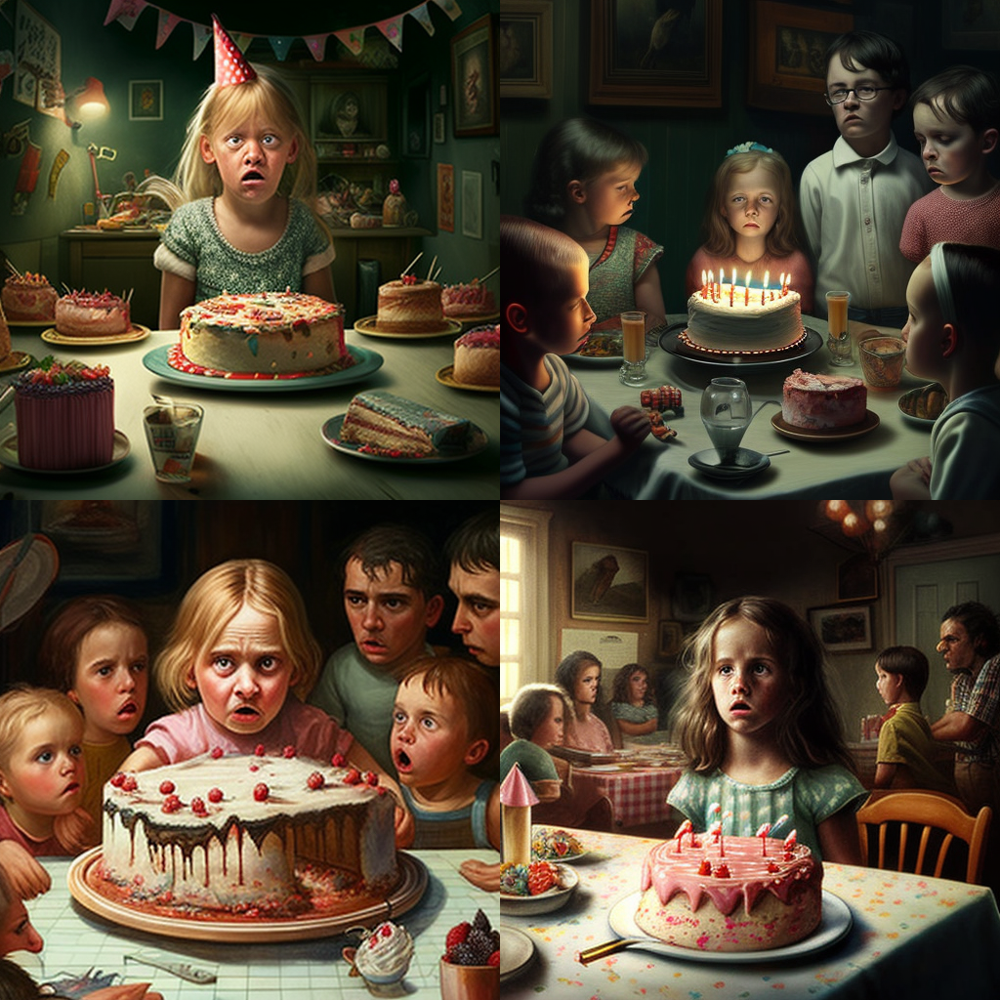

# Midjourney: From pixels to paintings

Midjourney is an independent research lab that has been making waves in the world of artificial intelligence with its eponymous AI program. The program is designed to create images from textual descriptions, much like OpenAI’s DALL-E and Stable Diffusion. While the underlying technology is speculated to be based on Stable Diffusion, Midjourney’s creators have developed their own unique style for the generated images that have garnered a lot of attention from both AI enthusiasts and artists alike.

Midjourney AI Art showcase

The tool is currently in open beta, having entered this phase on July 12, 2022. Since then, it has been attracting a growing number of users who are fascinated by its capabilities. With Midjourney, users can create artwork using Discord bot commands, making the process of generating images quick and easy.

## Table of contents

- [Midjourney: From pixels to paintings](#midjourney-from-pixels-to-paintings)
  - [Table of contents](#table-of-contents)
  - [Posibilities](#posibilities)
    - [Emotions](#emotions)
    - [Journey Through Time](#journey-through-time)
    - [Art Medium](#art-medium)
    - [Color Pallete](#color-pallete)
    - [Surrounding Environment](#surrounding-environment)
  - [Prompt Engineering in Midjourney](#prompt-engineering-in-midjourney)
  - [Midjourney Parameters](#midjourney-parameters)
    - [Model](#model)
    - [Negative prompt](#negative-prompt)
    - [Upscale](#upscale)
    - [Seed](#seed)
    - [Stylize](#stylize)
  - [Variations](#variations)
  - [Image Blending](#image-blending)
  - [References](#references)

## Posibilities

### Emotions

### Journey Through Time

### Art Medium

### Color Pallete

### Surrounding Environment

## Prompt Engineering in Midjourney

Prompts are the game for generating unique and exciting images with the Midjourney Bot. They provide a text description of the image that you want to create and guide the bot in its generation process. Whether you want a photo, painting, or doodle, the prompt can help the bot produce the exact type of image you desire. The prompts are used with the **/imagine** command.

In Midjourney prompts, to ensure the bot generates specific details. Think about the subject, medium, environment, lighting, color, mood, and composition. Anything left unsaid will be randomized.

Advanced prompts can include one or more image URLs, multiple text phrases, and one or more parameters. Image URLs can be added to a prompt to influence the style and content of the finished result, and parameters can change how an image generates, such as aspect ratios, negative prompts, models, upscalers, and more.

## Midjourney Parameters

Parameters are options added to a prompt that can change how an image generates in Midjourney. These parameters can change an image’s aspect ratios, switch between different Midjourney model versions, and alter which upscaler is used, among other things. Parameters are always added to the end of a prompt, and multiple parameters can be added to each prompt.

Basic parameters include aspect ratios, chaos, negative prompting, rendering quality, seed, stop, style, and stylize.

### Model

Midjourney periodically releases updated versions of its models to enhance efficiency, coherence, and image quality. Each model has its own strengths and is designed for specific types of images.

A model can be selected for a generation job by adding its respective parameter at the end of the image prompt. The available models are:

- **Niji**: an alternative model focused on anime-style images, specified by using **-niji**

Prompt : knight with diamond armor -niji

- **High Definition**: an early alternative model that produces larger, less consistent images. This algorithm may be suitable for abstract and landscape images, specified by using **-hd**

Prompt : knight with diamond armor -hd

- **Test**: a special test model provided by Midjourney, specified by using **-test**

Prompt : knight with diamond armor -test

- **Testp**: a special photography-focused test model provided by Midjourney, specified by using **-testp**

Prompt : knight with diamond armor -testp

- **Version**: users can choose to use earlier versions of the Midjourney algorithm by specifying the version number (1, 2, 3, 4, or 5) or by using the shortcut **–v** followed by the version number. The current Midjourney V5 is the default setting.

Prompt : knight with diamond armor -v 4

### Negative prompt

It is also essential to focus on what you want in the image instead of what you don’t want. If you don’t want a cake at a party, instead of saying “no cake” in the prompt, try advanced prompting using the “-no” parameter to put “no cake” as a negative prompt.

Prompt : birthday party no cake

Prompt : birthday party -no cake

### Upscale

Midjourney generates a grid of low-resolution image options for each generation job and provides an upscaler for increasing the size and adding additional details to any grid image. Multiple upscale models are available for upscaling images:

- **Uplight**: an alternative light upscaler that results in an image closer to the original grid image. The upscaled image is less detailed and smoother. This upscaler can be selected using the **–uplight** option.

- **Detailed Upscaler**: The Detail Upscaler enhances an image to 1024px x 1024px size by incorporating numerous intricate details.

- **Upbeta**: an alternative beta upscaler that results in an image closer to the original grid image. The upscaled image has significantly fewer added details. This upscaler can be selected using the **–upbeta** option.
  
- **Upanime**: an alternative upscaler specifically trained to work with the **Niji** Midjourney Model.

### Seed

The seed number is a critical component of the Midjourney bot’s algorithm. The seed number creates a field of visual noise that serves as a starting point for generating the initial image grids. While seed numbers are generated randomly for each image, users can also specify a particular seed number using the **–seed** parameter.

Prompt : cyberpunk cat –seed 1071856 –q 2

### Stylize

The Stylize parameter, denoted by the **–stylize** or **–s** parameter, influences how strongly the bot applies its training in artistic color, composition, and forms. By adjusting the Stylize parameter, users can create images that are both true to the prompt and artistically compelling.

Low Stylization values produce images that closely match the prompt but are less artistic. High Stylization values create images that are very artistic but less connected to the prompt.

## Variations

Each midjourney image generation job created generates 4 images using the prompt. Once the images are generated, under the job, there are various buttons. If the results are not upto your liking, you can use the 🔄 button to regenerate all the images, and if you like any particular image, you can use the V1, V2, V3, and V4 buttons to generate variations of that respective image (from left to right and top to bottom).

## Image Blending

Image blending in Midjourney allows users to quickly upload 2–5 images and merge them into a new, unique image.

To use the command, simply type the **/blend** command followed by the images you want to merge. You can upload up to five images in total, and the blended image will be generated based on the concepts and aesthetics of each input image.

Input links of both images with the /blend command

## References

1. [Midjourney](https://midjourney.com/)
2. [From Pixels to Paintings: The Rise of Midjourney AI Art](https://learnopencv.com/rise-of-midjourney-ai-art/#advanced-prompts-for-midjourney)
