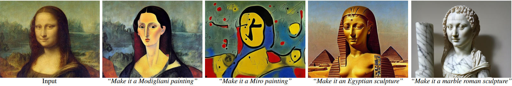
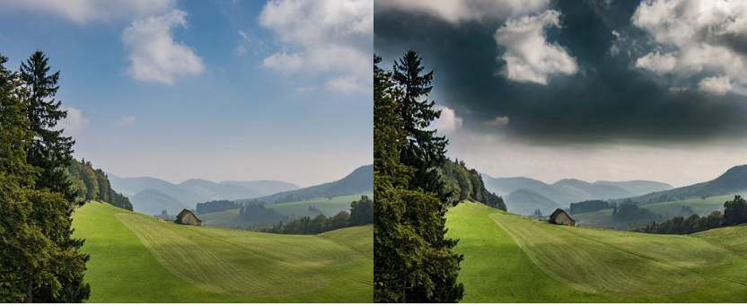

# InstructPix2Pix – Edit Images With Prompts

With the recent boom in [Stable Diffusion](https://github.com/Stability-AI/stablediffusion), generating images from text-based prompts has become quite common. Image2Image technique follows this approach allowing us to edit images through masking and inpainting. With rapid advancements in this technology, we no longer need masks to edit images. The new [InstructPix2Pix](https://arxiv.org/abs/2211.09800) takes this one step further by enabling users to provide natural language prompts that guide the image generation process.

## What is InstructPix2Pix?

InstructPix2Pix is a diffusion model, a variation of Stable Diffusion, to be particular. But instead of an image generation model (text-to-image), it is an image editing diffusion model. Just provide an input image and prompt instructions to InstructPix2Pix, then the model will follow the instructions to edit the image.

The core working of InstructPix2Pix remains similar to the original Stable Diffusion model. It still has:

1. A large transformer-based text encoder.
2. An autoencoder network that encodes images to latent space (only during training). The decoder decodes the final output of the UNet and upsamples it.
3. And a UNet model that works in the latent space to predict the noise.

Most of the changes happen in the training phase of the model. InstructPix2Pix is the culmination of training two different models, which we will address in the next section.

## Training InstructPix2Pix

The entire training procedure involves training two separate models. InstructPix2Pix is a multi-modal model which deals with both texts and images.

The authors combine the power of the GPT-3 language model and Stable Diffusion. The GPT-3 is used to generate text prompts (instructions) and a variation of the Stable Diffusion model is trained on these instructions and generated images.

### Fine-tuning GPT-3

The authors fine-tune the GPT-3 model to create a multi-modal training dataset. We can break down the entire process into the following points:

We provide an input caption to the GPT-3 model and train it on the caption. After training, it learns to generate the edit instructions and the final caption. For example, our input caption is:

A cat sitting on a couch

The edit instruction can be:

cat wearing a hat

In this case, the final caption can be:

A cat wearing a hat sitting on a couch

***Note: We only input the first caption to the GPT-3 model. It learns to generate both the edit instructions and the final edited caption as well.***

Interestingly, the GPT-3 model was fine-tuned on a relatively small dataset. The authors collected just 700 captions from the LAION-Aesthetics dataset. After that, edit instructions and output captions were automatically generated to train the model.

After training, we can feed a caption to the GPT-3 model, and it generates an edit instruction and the final caption. For training InstructPix2Pix, more than 450,000 caption pairs were created.

### Fine-Tuning Text-to-Image Stable Diffusion Model

After training the GPT-3 model and generating the caption pairs, the next step is fine-tuning a pre-trained Stable Diffusion model.

In the dataset, we have the initial and the final caption. Then we use the Stable Diffusion model to generate two images from these caption pairs.

However, there is an issue. Even if we fix the seed and other parameters, Stable Diffusion models tend to generate very different images even with similar prompts. So, the image generated from the edited caption mostly will not resemble an edited image; rather, it will be a different image entirely.

To overcome this, the authors use a technique called Prompt-to-Prompt. This technique allows text-to-image models to generate similar images with similar prompts. By default, we generate 100 samples per prompt and use [CLIP](https://github.com/openai/CLIP) filtering to keep a max of 4 per prompt.

The following figure from the paper depicts the training dataset generation and the inference phase of InstructPix2Pix:

As we can see, the inference process is quite simple. We just need an input image and an edit instruction. The InstructPix2Pix model does follow the edit instructions quite well for generating the final images.

### Classifier-Free Guidance for IntstructPix2Pix

The final image that InstructPix2Pix generates is a combination of the text prompt and the input image. During inference, we need a way to tell the model where to focus more – the image or text.

This is achieved through Classifier-free guidance which weighs over two conditional inputs. Let’s call these S_T and S_I for the text and input image, respectively.

During inference, guiding the more through S_T will condition the final image closer to the prompt. Similarly, instructing the model more through S_I will make the final image closer to the input image.

During the training phase, implementing classifier-free guidance helps the model learn conditional and unconditional denoising. We can call the image conditioning C_I and text conditioning C_T. For unconditional training, both are set to null.

When carrying out inference, choosing between S_T (more weight towards prompt) and S_I (more weight towards the initial image) is a tradeoff. We need to choose the settings according to the result that we want and based on our liking.

## InstructPix2Pix Results

The results published in the paper are pretty interesting. We can use InstructPix2Pix to recreate images with various artistic mediums or even different environmental styles.

Changing the weather from sunny to cloud using InstructPix2Pix

Changing the season from summer to winter using InstructPix2Pix

## Applications Using Instruct Pix2Pix

We can build some fairly nice applications using InstructPix2Pix. Two such applications are:

- Virtual makeup
- Virtual try-on
- And virtual hairstylist

InstructPix2Pix is good at swapping clothing styles, makeup, spectacles, and even hairstyles. The use of InstructPix2Pix as a virtual hair stylist is an interesting one because it is very hard to swap hairstyles in images while keeping the other facial features the same. However, provided with the right image, InstructPix2Pix can carry it out easily.

When used in the right way, applications like virtual makeup and virtual try-on will become easier to build and more accessible to the public also.

## References

1. [Stable Diffusion](https://github.com/Stability-AI/stablediffusion)
2. [OpenCV blog](https://learnopencv.com/stable-diffusion-generative-ai/)
3. [InstructPix2Pix paper](https://arxiv.org/abs/2211.09800)
4. [InstructPix2Pix source](https://github.com/timothybrooks/instruct-pix2pix)
5. [CLIP](https://github.com/openai/CLIP)
