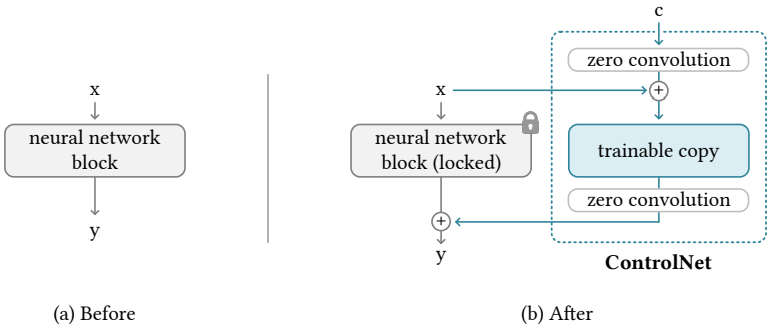

# ControlNet - Let us control diffusion models

[Stable Diffusion](https://github.com/Stability-AI/stablediffusion) models and their variations are great for generating novel images. But most of the time, we do not have much control over the generated images. Img2Img lets us control the style a bit, but the pose and structure of objects may differ in the final image. To mitigate this issue, we have a new Stable Diffusion-based neural network for image generation, [ControlNet](https://arxiv.org/abs/2302.05543).

ControlNet is a new way of conditioning input images and prompts for image generation. It allows us to control the final image generation through various techniques like pose, edge detection, depth maps, and many more.

During training, ControlNet learns specific features related to the tasks it is being fine-tuned on. These can range from generating images from canny images to more complicated ones, like generating images from normal maps.

## Table of Contents

- [ControlNet - Let us control diffusion models](#controlnet---let-us-control-diffusion-models)
  - [Table of Contents](#table-of-contents)
  - [What can ControlNet do?](#what-can-controlnet-do)
  - [Architecture](#architecture)
  - [Training](#training)
    - [Zero convolution](#zero-convolution)
    - [Training process](#training-process)
    - [Improve training for ControlNet](#improve-training-for-controlnet)
      - [Small-Scale Training](#small-scale-training)
      - [Large-Scale Training](#large-scale-training)
  - [ControlNet Implementations and Experiments](#controlnet-implementations-and-experiments)
  - [ControlNet Outputs](#controlnet-outputs)
    - [Canny Edge](#canny-edge)
    - [Hough Line](#hough-line)
    - [User Scribble](#user-scribble)
    - [HED Edge](#hed-edge)
    - [Human Pose](#human-pose)
    - [Segmentation Map](#segmentation-map)
    - [Normal Map](#normal-map)
  - [References](#references)

## What can ControlNet do?

The authors fine-tune ControlNet to generate images from **prompts** and **specific image structures**. As such, **ControlNet has two conditionings**. ControlNet models have been fine-tuned to generate images from:

- Canny edge
- Hough line
- Scribble drawing
- HED edge
- Pose detections
- Segmentation maps
- Depth maps
- Cartoon line drawing
- Normal maps

This gives us extra control over the images that we generate. Imagine that we find an image whose posture appeals to us.  Now, we want to create something different but with the same pose. It is difficult to achieve this with Vanilla Stable Diffusion and even with Img2Img. But ControlNet can help.

This is most helpful in situations where people know what shape and structure they would like but want to experiment by varying the color, environment, or object's texture.

For example, here is a sample from using the Canny Edge ControlNet model.

As you can see, only the pose of the deer remains the same in the final outputs while the environment, weather, and time of day are constantly changing. This was not possible before with vanilla Stable Diffusion models along with the Img2Img method. However, ControlNet has made it much easier to control the artistic outcome of the image.

## Architecture

- ControlNet first creates two copies of a trained large image diffusion model. One is a **locked copy** with frozen weights and the other is a **trainable copy** with trainable weights.
- The trainable copy learns from task-specific datasets during training, which gives us more control during inference.

Using the above approach, the authors trained several ControlNet models using different conditions. These include the Canny Edge model, the human pose model, and many others which were mentioned earlier.

## Training

The trainable copy of the model is trained with external conditions. The conditioning vector is c and this is what gives ControlNet the power to control the overall behavior of the neural network. Throughout the process of training the network, the parameters of the locked copy do not change.

### Zero convolution

As you may observe in the above image, we have a layer called zero convolution. This is a unique type of 1×1 convolutional layer. Initially, both the weights and biases of these layers are initialized with zeros.

The zero convolution layers help in stable training as the weights progressively grow from zeros to the optimized parameters.

### Training process

During the first training step, the parameters of the locked and trainable copies have values similar to those as if ControlNet does not exist. When applying ControlNet to neural blocks, before optimization, it does not influence any learned or deep features of its parameters. This preserves the learned features of the initial Stable Diffusion model, which has been pre-trained on billions of images.

Fine-tuning the trainable copy along with training of the zero convolution layers thus, results in a more stable training process. Also, the entire optimization process becomes as fast as fine-tuning compared to training the entire ControlNet from scratch.

The following image shows the complete ControlNet model along with the Stable Diffusion model The authors use the **Stable Diffusion 1.5** model.

### Improve training for ControlNet

#### Small-Scale Training

In small-scale training, we can consider two constraints:

- The amount of data available.
- The computation power.

For small-scale training, even a laptop with 8 GB RTX 3070Ti is enough. However, initially, the connections between all the model layers are not the same.

During the initial training steps, partially breaking the connections between a ControlNet block and the Stable Diffusion model helps in faster convergence. Once the model starts to learn (showing an association between the condition and the outputs), we can again connect the links.

#### Large-Scale Training

Here, large-scale training refers to huge datasets, more training steps, and using GPU clusters for training.

The paper considers large-scale training using 8 NVIDIA A100 80 GB GPUs, a dataset with over a million images, and training for more than 50000 steps.

Using such a large dataset reduces the risk of overfitting. In this case, we can train the ControlNet first and then unlock the Stable Diffusion model to train it from end to end.

An approach like this works better when the model needs to learn a very specific dataset.

## ControlNet Implementations and Experiments

There are various models of ControlNet according to the datasets and implementations. These include Canny Edge, Hough Line, Semantic Segmentation, and many more.

What’s interesting about these implementations is how we provide input and then condition the inputs, and get the outputs.

For example, in the case of using the Canny Edge ControlNet model, we do not give a Canny Edge image to the model.

Here are the steps on a high level:

- We will provide the model with an RGB image.
- An intermediate step will extract the Canny edges in the image.
- The final ControlNet model will give an output in a different style.

The following figure shows the steps for using the Canny ControlNet model.

The most interesting part about all this is that we don’t give a prompt to get an output. ControlNet tries to guess an output from the intermediate image in case we do not provide a prompt.

For prompt experiments, ControlNet supports the following options:

- No user prompt
- A default prompt like “a professional, detailed, high-quality image”
- Automatic prompt using [BLIP](https://github.com/salesforce/BLIP)
- Finally, a user prompt

## ControlNet Outputs

### Canny Edge

The above result shows that even without giving a prompt, the ControlNet canny model can produce excellent results.

Using the automatic prompt method improves the results to a good extent.

What’s more interesting is that once we have the Canny edge of a person, we can instruct the ControlNet model to generate an image of either a man or a woman. A similar thing occurs in the case of user prompts, where the model recreates the same image but swaps the man with a woman.

Here is another example of the Canny ControlNet model which can change the background with ease.

### Hough Line

We can use ControlNet to produce impressive variations of different architectures and designs. Hough Lines tend to work best in this case.

### User Scribble

It is not always necessary to have perfect edge images as the intermediate steps for generating good images.

Even a simple scribble from the user is sufficient. ControlNet will fill and generate astonishingly beautiful images like the above simply from the scribbles. There is one important point to observe here, though. Providing a prompt, in this case, works much better than the default (no prompt) option.

### HED Edge

HED Edge is another edge detection ControlNet model which produces great results.

### Human Pose

For using Human Pose ControlNet models, we have two options.

- Human pose – Openpifpaf
- Human pose – Openpose

Openpifpaf outputs more key points for the hands and feet which is excellent for controlling hand and leg movements in the final outputs. This is evident from the above results.

When we have a rough idea of the pose of the person and want to have more artistic control over the environment in the final image, then Openpose works perfectly.

### Segmentation Map

In situations where we require greater command over various objects within an image, the Segmentation Map ControlNet model proves to be the most effective.

The above figure displays various objects in the room, albeit in different settings each time. Additionally, the color scheme of the room and furniture tend to match quite well.

We can also use it on outdoor scenes for varying the time of day and surroundings. For example, take a look at the following image.

### Normal Map

In case you need to have more textures, lighting, and bumps taken into consideration, you can use the Normal Map ControlNet model.

## References

1. [Stable Diffusion](https://github.com/Stability-AI/stablediffusion)
2. [ControlNet](https://github.com/lllyasviel/ControlNet)
3. [ControlNet models and weights](https://huggingface.co/lllyasviel/ControlNet)
4. [Try ControlNet on HuggingFace](https://huggingface.co/spaces/hysts/ControlNet)
5. [OpenCV blog](https://learnopencv.com/controlnet/)
6. [BLIP](https://github.com/salesforce/BLIP)
