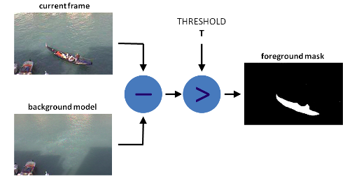
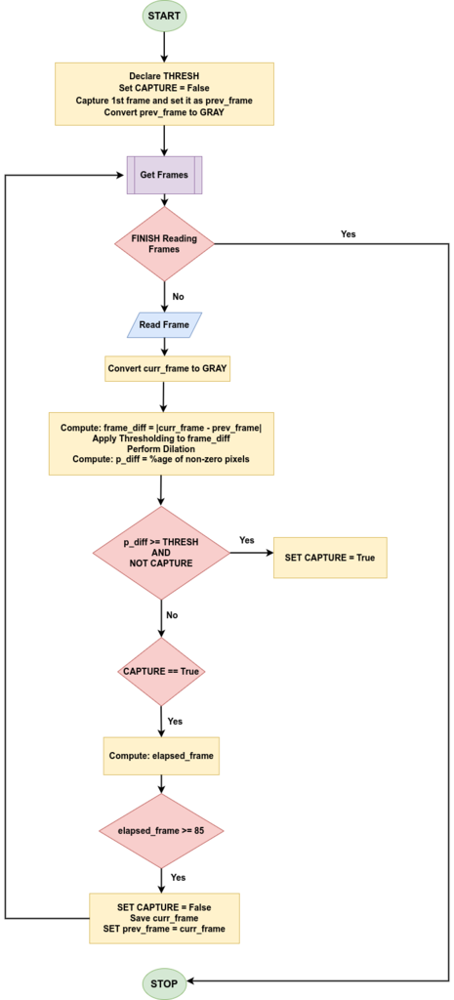
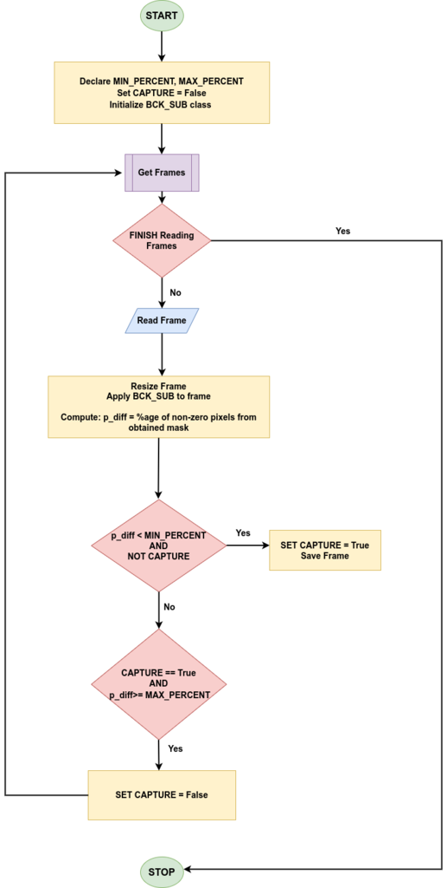

# Video to Slides Converter: Transform Video Lectures into Slide Presentations

This is a simple video-to-slide converter application that aims to obtain slide images (or pdf) given slide or lecture videos.

This is highly useful when one wishes to have a video lecture(with or without animations) in the form of slides – either a ppt or pdf. However, more often than not, slides are not provided when such video lectures are hosted on platforms like YouTube. This project aims to build a robust application that can convert video lectures into corresponding slides using techniques such as basic frame differencing and statistical background subtraction models such as **KNN** or **GMG**.

## Table of Contents

- [Video to Slides Converter: Transform Video Lectures into Slide Presentations](#video-to-slides-converter-transform-video-lectures-into-slide-presentations)
  - [Table of Contents](#table-of-contents)
  - [What is Background Subtraction?](#what-is-background-subtraction)
  - [Common Background Subtraction Techniques in OpenCV](#common-background-subtraction-techniques-in-opencv)
  - [Application workflow](#application-workflow)
    - [Frame Differencing](#frame-differencing)
    - [Probabilistic Background Modeling](#probabilistic-background-modeling)
    - [Post-processing](#post-processing)
  - [Development](#development)
    - [Dependencies](#dependencies)
    - [Gradio App](#gradio-app)
    - [Sample outputs](#sample-outputs)
  - [Scope for improvements](#scope-for-improvements)
  - [References](#references)

## What is Background Subtraction?

Background subtraction is a technique for separating foreground objects from the background in a video sequence. The idea is to model the scene's background and subtract it from each frame to obtain the foreground objects. This is useful in many computer vision applications, such as object tracking, activity recognition, and crowd analysis. Therefore, we can extend this concept to convert slide videos into the corresponding slides where the notion of motion is the various animations encountered through the video sequence.



Background modeling consists of two main steps:

- Background Initialization
- Background Update

In the first step, an initial model of the background is computed, while in the second, the model is updated to adapt to possible changes in the scene. Background Estimation can also be applied to motion-tracking applications such as traffic analysis, people detection, etc.

One common question to model the background is whether we can achieve it by simply performing a frame differencing between the previous and current frames. While this approach can work for videos with static frames, it does not yield good results for videos with significant animations.

Therefore, for videos with significant animations, it becomes imperative to model the background with statistical approaches instead of naive frame differencing. There are quite a few background separation approaches already provided by OpenCV.

## Common Background Subtraction Techniques in OpenCV

- **KNN-based Background Subtraction**: A non-parametric modeling approach that implements the K-nearest neighbors technique for background/foreground segmentation. The function prototype for creating an object for the KNN Background subtraction model in OpenCV is:
cv2.createBackgroundSubtractorKNN([, history[, dist2Threshold[, detectShadows]]])
- **Mixture of Gaussians (MOG v2)**: This parametric modeling approach implements an efficient adaptive algorithm using a Gaussian mixture probability density function for Background/Foreground Segmentation to better handle variations in the background over time and complex backgrounds with multiple colors and textures.
The function prototype is:
cv2.createBackgroundSubtractorMOG2([, history[, varThreshold[, detectShadows]]])
- **GMG Background Subtraction**: This approach was introduced in the paper [Visual Tracking of Human Visitors under Variable-Lighting Conditions for a Responsive Audio Art Installation](https://www.researchgate.net/publication/261311764_Visual_tracking_of_human_visitors_under_variable-lighting_conditions_for_a_responsive_audio_art_installation). It is a parametric approach that combines statistical background image estimation and per-pixel Bayesian segmentation.
It uses the first few (120 by default) frames for background modeling. It employs a probabilistic foreground segmentation algorithm that identifies possible foreground objects using Bayesian inference. The estimates are adaptive; newer observations are more heavily weighted than old observations to accommodate variable illumination.
The function prototype is:
cv2.bgsegm.createBackgroundSubtractorGMG([, initializationFrames[,  decisionThreshold]])

One can also use an improved version of the spatiotemporal Local Binary Similarity Patterns (LBSP) approach, such as [Self-Balanced Sensitivity Segmenter](https://learnopencv.com/background-subtraction-with-opencv-and-bgs-libraries/) (SuBSENSE), for background estimation.

## Application workflow

### Frame Differencing

Background Subtraction through frame differencing is quite simple.

- We begin by retrieving the video frames in grayscale.
- Compute the absolute difference between successive frames and calculate the foreground mask percentage after some morphological operations.
- Save that particular frame if this percentage exceeds a certain threshold.



### Probabilistic Background Modeling

- Just as was the case with frame differencing, we start by retrieving the video frames.
- Pass each of them through a background subtraction model, which generates a binary mask, and then calculate the percentage of foreground pixels in that frame.
- If this percentage is above a specific threshold **T1**, it indicates some motion (animations in our case), and we wait till the motion settles down. Once the percentage is below a threshold **T2**, we save the corresponding frame.



### Post-processing

Now that we have obtained slide images using background modeling, one significant concern remains. Many of the generated screenshots are broadly similar. Therefore, we have our task cut out to eliminate such images.

We apply a popular technique called image hashing to achieve this task. It should be borne in mind that we cannot apply more popular cryptographic hashing algorithms such as **MD5** or **SHA-1**. Cryptographic hashing techniques cause minor differences in the pixel values of similar images to be completely different. Image hashing techniques can mitigate this problem by yielding similar (or identical) hashes for similar images.

There are several approaches for image hashing, such as [average hashing](http://www.hackerfactor.com/blog/index.php?/archives/432-Looks-Like-It.html), [perceptual hashing](http://www.hackerfactor.com/blog/index.php?/archives/432-Looks-Like-It.html), [difference hashing](http://www.hackerfactor.com/blog/index.php?/archives/529-Kind-of-Like-That.html), [wavelet hashing](https://fullstackml.com/2016/07/02/wavelet-image-hash-in-python/), etc. These algorithms analyze the image structure on luminance (without color information).

## Development

### Dependencies

1. Install OpenCV
    **If you already have opencv installed, skip this step**

    ```bash
    pip install opencv-contrib-python==4.7.0.72
    ```

2. Install other packages

    ```bash
    pip install -r requirements.txt
    ```

3. Install gradio (optional)
   **If you don't use the GUI version, skip this step**

   ```bash
    pip install gradio
    ```

### Command-Line Options

```bash
usage: video_2_slides.py [-h] [-v VIDEO_FILE_PATH] [-o OUT_DIR] [--type {Frame_Diff,GMG,KNN}] [-hf {dhash,phash,ahash}] [-hs {8,12,16}]
                         [--threshold {90,91,92,93,94,95,96,97,98,99,100}] [-q QUEUE_LEN] [--no_post_process] [--convert_to_pdf]

This script is used to convert video frames into slide PDF.

optional arguments:
  -h, --help            show this help message and exit
  -v VIDEO_PATH, --video_path VIDEO_FILE_PATH
                        Path to the video file, video url, or YouTube video link
  -o OUT_DIR, --out_dir OUT_DIR
                        Path to the output directory
  --type {Frame_Diff,GMG,KNN}
                        type of background subtraction to be used
  -hf {dhash,phash,ahash}, --hash-func {dhash,phash,ahash}
                        Hash function to use for image hashing. Only effective if post-processing is enabled
  -hs {8,12,16}, --hash-size {8,12,16}
                        Hash size to use for image hashing. Only effective if post-processing is enabled
  --threshold {90,91,92,93,94,95,96,97,98,99,100}
                        Minimum similarity threshold (in percent) to consider 2 images to be similar. Only effective if post-processing is enabled
  -q QUEUE_LEN, --queue-len QUEUE_LEN
                        Number of history images used to find out duplicate image. Only effective if post-processing is enabled
  --no_post_process     flag to apply post processing or not
  --convert_to_pdf      flag to convert the entire image set to pdf or not
```

If you want to manually remove some images before generating final PDF file, you can use the `convert_to_pdf.py` script later to convert the entire image set to pdf

```bash
usage: convert_to_pdf.py [-h] [-f FOLDER] [-o OUT_PATH]

This script is used to convert video frames into slide PDFs.

optional arguments:
  -h, --help            show this help message and exit
  -f FOLDER, --folder FOLDER
                        Path to the image folder
  -o OUT_PATH, --out_path OUT_PATH
                        Path to the output PDF file. If None, the image
                        directory will be used to store the output file.
```

### Gradio App

```bash
gradio app.py
```

The application will be available at [http://localhost:7680](http://localhost:7680)

### Sample outputs

| Video file | Output |
|---|---|
| [https://www.youtube.com/watch?v=bfmFfD2RIcg](https://www.youtube.com/watch?v=bfmFfD2RIcg) | output_results/Neural Network In 5 Minutes.pdf  |
| sample_vids/react-in-5-minutes.mp4 | output_results/react-in-5-minutes.pdf |

## Scope for improvements

We have seen how the various background estimation approaches produce decent results for scenes with significant animations. Similarly, scenes containing mostly static frames can be handled by a naive frame differencing approach.

The KNN background estimation approach yields almost three times faster in FPS than its GMG counterpart. However, in some video samples, the KNN approach misses out on a few frames.

The application yields almost perfect results for both lectures having voice-over presentations or facial camera movements. However, the only minus point is that the processing speed is not very fast, it will take about 40% of the original video length to complete. We can mitigate this by using more computing resources or a deep-learning-based approach with powerful GPU devices.

For slide videos with full background animation similar to [this video](https://www.youtube.com/watch?v=YxlDoz_P4kc), the algorithm cannot extract the right frames ateaftthe animation ends. In that case, using Frame Differencing (`--type Frame_Diff`) will yield better results, but the results are still decent.

## References

1. [OpenCV blog](https://learnopencv.com/video-to-slides-converter-using-background-subtraction/)
2. [Simple Background Estimation in Videos using OpenCV](https://learnopencv.com/simple-background-estimation-in-videos-using-opencv-c-python/)
3. [Image Hashing](https://www.hackerfactor.com/blog/index.php?/archives/529-Kind-of-Like-That.html)
