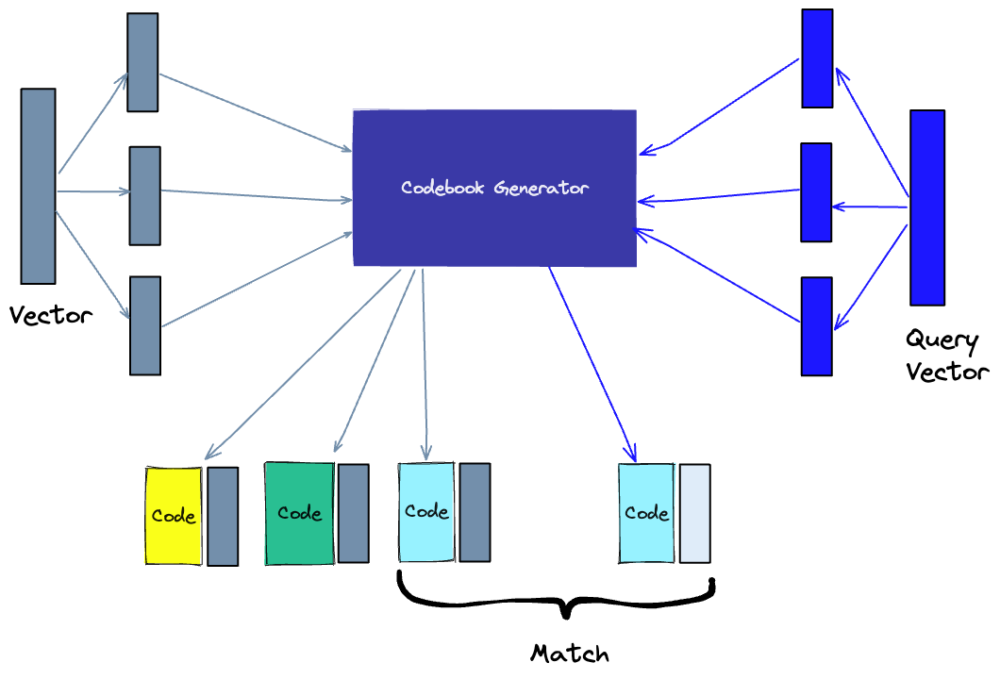

# The Future of AI: Innovations in Vector Databases

## Table of Contents

- [The Future of AI: Innovations in Vector Databases](#the-future-of-ai-innovations-in-vector-databases)
  - [Table of Contents](#table-of-contents)
  - [Differences between a vector index and a vector database](#differences-between-a-vector-index-and-a-vector-database)
  - [How does a vector database work?](#how-does-a-vector-database-work)
    - [Algorithms](#algorithms)
      - [Random Projection](#random-projection)
      - [Product Quantization](#product-quantization)
      - [Locality-sensitive hashing](#locality-sensitive-hashing)
      - [Hierarchical Navigable Small World (HNSW)](#hierarchical-navigable-small-world-hnsw)
    - [Similarity Measures](#similarity-measures)
    - [Filtering](#filtering)
  - [Summary](#summary)
  - [References](#references)

We are in the middle of the AI revolution. It's upending any industry it touches, promising great innovations - but it also introduces new challenges. Efficient data processing has become more crucial than ever for applications that involve large language models, generative AI, and semantic search.

All of these new applications rely on vector embeddings, a type of data representation that carries within it semantic information that's critical for the AI to gain understanding and maintain a long-term memory they can draw upon when executing complex tasks.

Embeddings are generated by AI models (such as Large Language Models) and have a large number of attributes or features, making their representation challenging to manage. In the context of AI and machine learning, these features represent different dimensions of the data needed for understanding underlying patterns, relationships, and structures.

That is why we need a specialized database designed specifically for handling this type of data. Vector databases fulfill this requirement by offering optimized storage and querying capabilities for embeddings. Vector databases also have the capabilities of a traditional database that are absent in standalone vector indexes and the specialization of dealing with vector embeddings, which traditional scalar-based databases lack.

The challenge of working with vector embeddings is that traditional scalar-based databases can not keep up with the complexity and scale of such data, making it difficult to extract insights and perform real-time analysis. That's where vector databases come into play – they are intentionally designed to handle this type of data and offer the performance, scalability, and flexibility you need to make the most out of your data.

With a vector database, we can add advanced features to our AIs, like semantic information retrieval, long-term memory, and more. The diagram below gives us a better understanding of the role of vector databases in this type of application:

1. First, we use the **embedding model** to create **vector embeddings** for the content we want to index.
2. The **vector embedding** is inserted into the **vector database**, with some reference to the original content.
3. When the application issues a query, we use the same **embedding model** to create embeddings for the query and use those embeddings to query the database for *similar* vector embeddings. As mentioned before, those similar embeddings are associated with user-retrievable original content.

## Differences between a vector index and a vector database

Standalone vector indices like [FAISS](https://www.pinecone.io/learn/faiss/) (Facebook AI Similarity Search) can significantly improve the search and retrieval of vector embeddings, but they lack capabilities that exist in any database. Vector databases, on the other hand, are purpose-built to manage vector embeddings, providing several advantages over using standalone vector indices:

1. Data management: Vector databases offer well-known and easy-to-use features for data storage, like inserting, deleting, and updating data. This makes managing and maintaining vector data easier than using a standalone vector index like FAISS, which requires additional work to integrate with a storage solution.
2. Metadata storage and filtering: Vector databases can store metadata associated with each vector entry. Users can then query the database using additional metadata filters for finer-grained queries.
3. Scalability: Vector databases are designed to scale with growing data volumes and user demands, providing better support for distributed and parallel processing. Standalone vector indices may require custom solutions to achieve similar levels of scalability (such as deploying and managing them on Kubernetes clusters or other similar systems).
4. Real-time updates: Vector databases often support real-time data updates, allowing for dynamic changes to the data, whereas standalone vector indexes may require a re-indexing process to incorporate new data, which can be time-consuming and computationally expensive.
5. Ecosystem integration: Vector databases can more easily integrate with other components of a data processing ecosystem, such as ETL pipelines (like [Spark](https://spark.apache.org/)), analytics tools (like [Tableau](https://www.tableau.com/) and [PowerBI](https://powerbi.microsoft.com/en-au/)), and visualization platforms (like [Grafana](https://grafana.com/)) – streamlining the data management workflow. It also enables easy integration with other AI-related tools like [LangChain](https://python.langchain.com/en/latest/index.html), [LlamaIndex](https://gpt-index.readthedocs.io/), and [ChatGPT's Plugins](https://openai.com/blog/chatgpt-plugins).
6. Data security and access control: Vector databases typically offer built-in data security features and access control mechanisms to protect sensitive information, which may not be available in standalone vector index solutions.

In short, a vector database provides a superior solution for handling vector embeddings by addressing the limitations of standalone vector indices, such as scalability challenges, cumbersome integration processes, and the absence of real-time updates and built-in security measures, ensuring a more effective and streamlined data management experience.

## How does a vector database work?

We all know how traditional databases work (more or less)—they store strings, numbers, and other types of scalar data in rows and columns. On the other hand, a vector database operates on vectors, so the way it's optimized and queried is quite different.

In traditional databases, we are usually querying for rows in the database where the value usually exactly matches our query. In vector databases, we apply a similarity metric to find a vector that is the **most similar** to our query.

A vector database uses a combination of different algorithms that all participate in the [Approximate Nearest Neighbor (ANN)](https://towardsdatascience.com/comprehensive-guide-to-approximate-nearest-neighbors-algorithms-8b94f057d6b6) search. These algorithms optimize the search through hashing, quantization, or graph-based search.

These algorithms are assembled into a pipeline that provides fast and accurate retrieval of the neighbors of a queried vector. Since the vector database provides **approximate** results, the main trade-offs we consider are between accuracy and speed. The more accurate the result, the slower the query will be. However, a good system can provide ultra-fast search with near-perfect accuracy.

Here's a common pipeline for a vector database:

1. **Indexing**: The vector database indexes vectors using an algorithm such as PQ, LSH, or HNSW (more on these below). This step maps the vectors to a data structure that will enable faster searching.
2. **Querying**: The vector database compares the indexed query vector to the indexed vectors in the dataset to find the nearest neighbors (applying a similarity metric used by that index)
3. **Post Processing**: In some cases, the vector database retrieves the final nearest neighbors from the dataset and post-processes them to return the final results. This step can include re-ranking the nearest neighbors using a different similarity measure.

### Algorithms

Several algorithms can facilitate the creation of a vector index. Their common goal is to enable fast querying by creating a data structure that can be traversed quickly. They will commonly transform the representation of the original vector into a compressed form to optimize the query process.

#### Random Projection

The basic idea behind random projection is to project the high-dimensional vectors to a lower-dimensional space using a random projection matrix. We create a matrix of random numbers. The size of the matrix is going to be the target low-dimension value we want. We then calculate the dot product of the input vectors and the matrix, which results in a projected matrix that has fewer dimensions than our original vectors but still preserves their similarity.

When we query, we use the same projection matrix to project the query vector onto the lower-dimensional space. Then, we compare the projected query vector to the projected vectors in the database to find the nearest neighbors. Since the dimensionality of the data is reduced, the search process is significantly faster than searching the entire high-dimensional space.

Just keep in mind that random projection is an approximate method, and the projection quality depends on the properties of the projection matrix. In general, the more random the projection matrix is, the better the quality of the projection will be. But generating a truly random projection matrix can be computationally expensive, especially for large datasets.

#### Product Quantization

Another way to build an index is product quantization (PQ), which is a lossy compression technique for high-dimensional vectors (like vector embeddings). It takes the original vector, breaks it up into smaller chunks, simplifies the representation of each chunk by creating a representative *“code”* for each chunk, and then puts all the chunks back together - without losing information that is vital for similarity operations. The process of PQ can be broken down into four steps: splitting, training, encoding, and querying.

1. Splitting: The vectors are broken into segments.
2. Training: we build a “codebook” for each segment. Simply put - the algorithm generates a pool of potential “codes” that could be assigned to a vector. In practice - this “codebook” is made up of the center points of clusters created by performing k-means clustering on each of the vector's segments. We would have the same number of values in the segment codebook as the value we use for the k-means clustering.
3. Encoding: The algorithm assigns a specific code to each segment. In practice, we find the nearest value in the codebook to each vector segment after the training is complete. Our PQ code for the segment will be the identifier for the corresponding value in the codebook. We could use as many PQ codes as we'd like, meaning we can pick multiple values from the codebook to represent each segment.
4. Querying: When we query, the algorithm breaks down the vectors into sub-vectors and quantizes them using the same codebook. Then, it uses the indexed codes to find the nearest vectors to the query vector.

The number of representative vectors in the codebook is a trade-off between the accuracy of the representation and the computational cost of searching the codebook. The more representative vectors in the codebook, the more accurate the representation of the vectors in the subspace, but the higher the computational cost to search the codebook. By contrast, the fewer representative vectors in the codebook, the less accurate the representation, but the lower the computational cost.

#### Locality-sensitive hashing

Locality-Sensitive Hashing (LSH) is a technique for indexing in the context of an approximate nearest-neighbor search. It is optimized for speed while still delivering an approximate, non-exhaustive result. LSH maps similar vectors into “buckets” using a set of hashing functions, as seen below:

To find the nearest neighbors for a given query vector, we use the same hashing functions used to “bucket” similar vectors into hash tables. The query vector is hashed to a particular table and then compared with the other vectors in that same table to find the closest matches. This method is much faster than searching through the entire dataset because there are far fewer vectors in each hash table than in the whole space.

It's important to remember that LSH is an approximate method, and the quality of the approximation depends on the properties of the hash functions. In general, the more hash functions used, the better the approximation quality will be. However, using a large number of hash functions can be computationally expensive and may not be feasible for large datasets.

#### Hierarchical Navigable Small World (HNSW)

HSNW creates a hierarchical, tree-like structure where each node of the tree represents a set of vectors. The edges between the nodes represent the similarity between the vectors. The algorithm starts by creating a set of nodes, each with a small number of vectors. This could be done randomly or by clustering the vectors with algorithms like k-means, where each cluster becomes a node.

The algorithm then examines the vectors of each node and draws an edge between that node and the nodes that have the most similar vectors to the one it has.

When we query an HSNW index, it uses this graph to navigate through the tree, visiting the nodes that are most likely to contain the closest vectors to the query vector.

### Similarity Measures

Building on the previously discussed algorithms, we need to understand the role of similarity measures in vector databases. These measures are the foundation of how a vector database compares and identifies the most relevant results for a given query.

Similarity measures are mathematical methods for determining how similar two vectors are in a vector space. Similarity measures are used in vector databases to compare the vectors stored in the database and find the ones that are most similar to a given query vector.

Several similarity measures can be used, including:

- **Cosine similarity**: measures the cosine of the angle between two vectors in a vector space. It ranges from -1 to 1, where 1 represents identical vectors, 0 represents orthogonal vectors, and -1 represents vectors that are opposed.
- **Euclidean distance**: measures the straight-line distance between two vectors in a vector space. It ranges from 0 to infinity, where 0 represents identical vectors, and larger values represent increasingly dissimilar vectors.
- **Dot product**: measures the product of the magnitudes of two vectors and the cosine of the angle between them. It ranges from -∞ to ∞, where a positive value represents vectors that point in the same direction, 0 represents orthogonal vectors, and a negative value represents vectors that point in opposite directions.

The choice of similarity measure will affect the results obtained from a vector database. It is also important to note that each similarity measure has its advantages and disadvantages, and it is important to choose the right one depending on the use case and requirements.

### Filtering

Every vector stored in the database also includes metadata. In addition to the ability to query for similar vectors, vector databases can also filter the results based on a metadata query. To do this, the vector database usually maintains two indexes: a vector index and a metadata index. It then performs the metadata filtering either before or after the vector searches itself, but in either case, some difficulties cause the query process to slow down.

The filtering process can be performed either before or after the vector search itself, but each approach has its challenges that may impact the query performance:

- **Pre-filtering**: In this approach, metadata filtering is done before the vector search. While this can help reduce the search space, it may also cause the system to overlook relevant results that don't match the metadata filter criteria. Additionally, extensive metadata filtering may slow down the query process due to the added computational overhead.
- **Post-filtering**: In this approach, the metadata filtering is done after the vector search. This can help ensure that all relevant results are considered, but it may also introduce additional overhead and slow down the query process as irrelevant results need to be filtered out after the search is complete.

To optimize the filtering process, vector databases use various techniques, such as leveraging advanced indexing methods for metadata or using parallel processing to speed up the filtering tasks. Balancing the trade-offs between search performance and filtering accuracy is essential for providing efficient and relevant query results in vector databases.

## Summary

The exponential growth of vector embeddings in fields such as NLP, computer vision, and other AI applications has resulted in the emergence of vector databases as the computation engine that allows us to interact effectively with vector embeddings in our applications.

Vector databases are purpose-built databases that are specialized to tackle the problems that arise when managing vector embeddings in production scenarios. For that reason, they offer significant advantages over traditional scalar-based databases and standalone vector indexes.

In this post, we reviewed the key aspects of a vector database, including how it works, what algorithms it uses, and the additional features that make it operationally ready for production scenarios.

## References

1. [Pinecone vector database](https://www.pinecone.io/learn/vector-database/)
