# Image Super Resolution

The resolution of an image is the number of pixels displayed per square inch (PPI) of a digital image. Super-Resolution (SR) refers to enhancing the resolution of an image (or any type of signal like video sequences) from its low-resolution counterpart(s).

For example, when you zoom in on a digital image, you start seeing the image starting to get blurry. This is because the pixel density in the zoomed region is just linear interpolation which is not enough to portray a clear image.

Here’s an example of SR aiming to obtain the HR image when given an LR image:

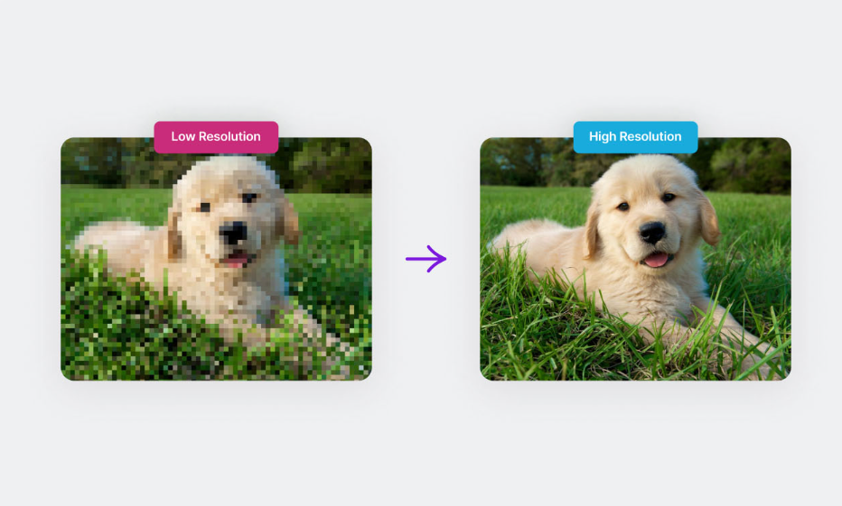

Suppose an image is of resolution (i.e., the image dimensions) 64x64 pixels and is super-resolved to a resolution of 256x256 pixels. In that case, the process is known as 4x upsampling since the spatial dimensions (height and width of the image) are upscaled four times.

Now, a Low Resolution (LR) image can be modeled from a High Resolution (HR) image, mathematically, using a degradation function, delta, and a noise component, eta as the following:

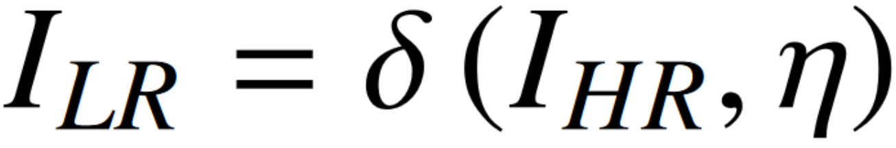

In supervised learning methods, models aim to purposefully degrade the image using the above equation and use this degraded image as inputs to the deep model and the original images as the HR ground truth. This forces the model to learn a mapping between a low-resolution image and its high-resolution counterpart, which can then be applied to super-resolve any new image during the testing time.

The first-ever image of the black hole, which is located millions of light-years away from us, was not technically *captured*. The information captured was super-resolved to the final image we have now. SR technology has far passed its infant stage and is now being applied to areas like military, surveillance, biomedical imaging (especially in microscopic studies), etc. The recent focus of SR research is on reducing the need for labeled samples since we have already attained peak results using Supervised Learning.

## Single-Image vs Multi-Image Super Resolution

Two types of Image SR methods exist depending on the amount of input information available. In Single-Image SR, only one LR image is available, which needs to be mapped to its high-resolution counterpart. In Multi-Image SR, however, multiple LR images of the same scene or object are available, which are all used to map to a single HR image.

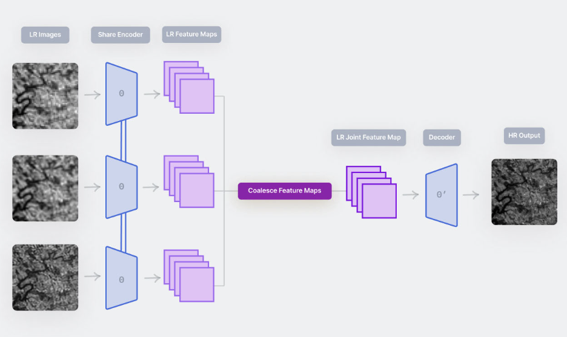

In Single-Image SR methods, since the amount of input information available is low, fake patterns may emerge in the reconstructed HR image, which has no discernible link to the context of the original image. This can create ambiguity which in turn can lead to the misguidance of the final decision-makers (scientists or doctors), especially in delicate application areas like bioimaging.

Intuitively, we can conclude that Multi-Image SR produces better performance since it has more information to work with. However, the computational cost in such cases is also increased several-fold, making it infeasible in many application scenarios where there is a substantial resource constraint. Also, obtaining multiple LR images of the same object is tedious and not practical. Thus, Single-Image SR is more closely related to the real world, although it is a more challenging problem statement.

In fully supervised Multi-Image SR methods, typically, different degradation functions are used on the HR image (the ground truths) to obtain slightly different types of LR images for the same scene. This helps the model make better generalizations thanks to the diversity of available information. In other cases, augmented versions (rotation, flipping, affine transform, etc.) of the same LR image are used.

## Evaluation Techniques

Visual cues are not enough to evaluate and compare the performance of different SR methods since they are very subjective in nature. A universal quantitative measure of SR performance is required to compare models in a fair way.

[Peak Signal-to-Noise Ratio](https://en.wikipedia.org/wiki/Peak_signal-to-noise_ratio) (PSNR) and [Structural SIMilarity Index](https://en.wikipedia.org/wiki/Structural_similarity) (SSIM) are the two most commonly used evaluation metrics for evaluating SR performance. PSNR and SSIM measures are generally both used together for a fair evaluation of methods compared to the state-of-the-art.

### PSNR

Peak Signal-to-Noise Ratio or PSNR is an objective metric that measures the quality of image reconstruction of a lossy transformation. Mathematically it is defined by the following:

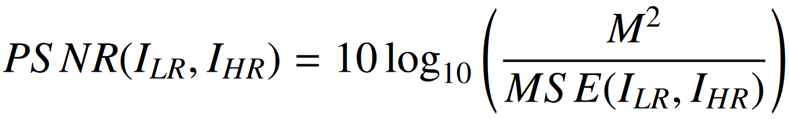

Here, MSE represents the pixel-wise Mean Squared Error between the images, and “M” is the maximum possible value of a pixel in an image (for 8-bit RGB images, we are used to M=255). The higher the value of PSNR (in decibels/dB), the better the reconstruction quality.

### SSIM

The Structural SIMilarity (SSIM) Index is a subjective measure that determines the structural coherence between two images (the LR and super-resolved HR images in this case). Mathematically it can be defined as follows:

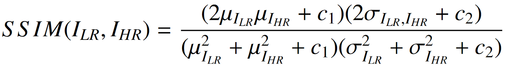
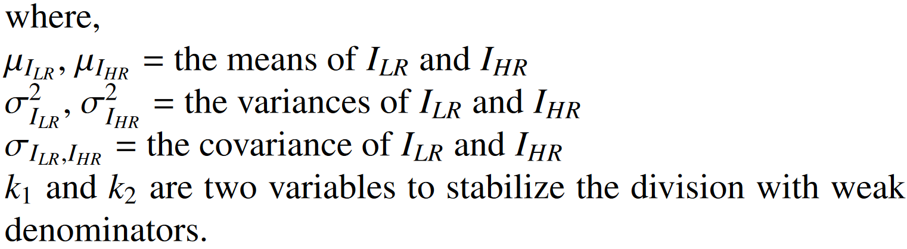

SSIM ranges between 0 and 1, where a higher value indicates greater structural coherence and thus better SR capability.

## Learning Strategies

### Pre Upsampling

In this class of methods, the LR input image is first upsampled to meet the dimensions of the required HR output. Then processing is done on the upscaled LR image using a Deep Learning model.

[VDSR](https://openaccess.thecvf.com/content_cvpr_2016/papers/Kim_Accurate_Image_Super-Resolution_CVPR_2016_paper.pdf) is an early attempt at the SR problem that uses the Pre Upsampling method. The VDSR network utilizes a very deep (20 weight layers) convolutional network (hence the name) inspired by VGG networks.

Typically deep networks converge slowly if the learning rates are low. However, boosting convergence and high learning rates might lead to exploding gradients. Thus, in VDSR, residual learning and gradient clipping has been used to address these issues. Further, VDSR tackles multi-scaled SR problems using just one network. VDSR’s network architecture is shown below.

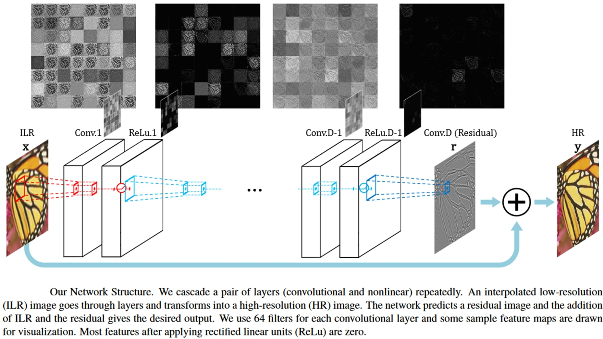

An example of a super-resolved image obtained by the VDSR network compared to the then state-of-the-art is shown below.

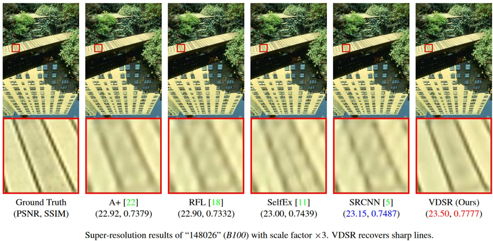

### Post Upsampling

Increasing the resolution of the LR images (in Pre Upsampling methods) before the image enhancement step increases the computational complexity. This is especially problematic for convolutional networks, where the processing speed directly depends on the input image resolution. Secondly, interpolation methods typically used to accomplish the task, such as bicubic interpolation, do not bring additional information to solve the ill-posed reconstruction problem.

Thus, in the Post Upsampling class of SR methods, the LR image is first processed for enhancement using a deep model, and then it is upscaled using traditional techniques like bicubic interpolation to meet the HR image dimension criteria.

[FSRCNN](https://arxiv.org/pdf/1608.00367.pdf) is a popular SR model (an improvement to the [SRCNN](https://arxiv.org/pdf/1501.00092.pdf) model) that uses the Post Upsampling technique. In the FSRCNN architecture, the feature extraction is performed in the LR space. FSRCNN also uses a 1x1 convolution layer after feature extraction to reduce the computational cost by reducing the number of channels. The architecture of the FSRCNN model is shown below.

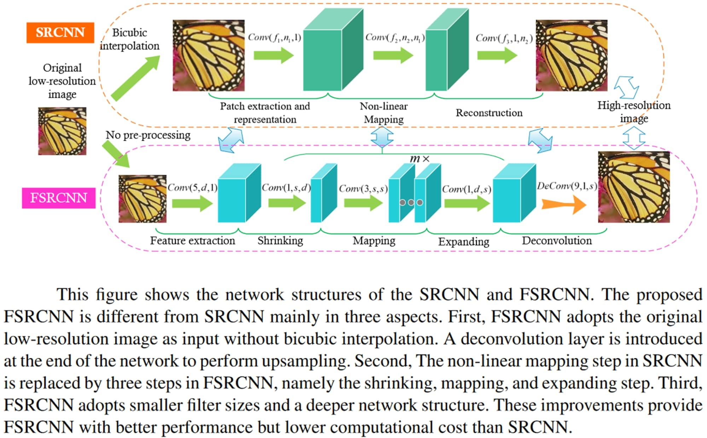

Some results obtained by the FSRCNN model when compared to the state-of-the-art methods are shown below. FSRCNN performed better than SRCNN while having a much lesser computational cost.

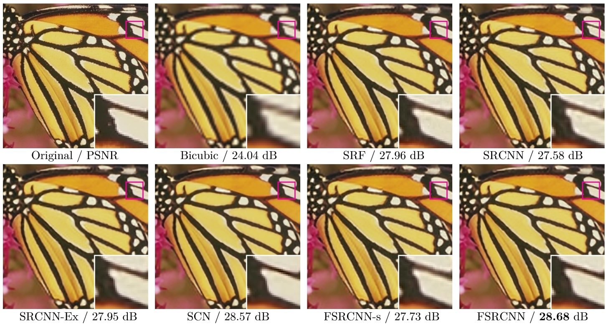

### Progressive Upsampling

Pre and Post Upsampling methods are both useful methods. However, for problems where LR images need to be upscaled by large factors (say 8x), regardless of whether the upsampling is done before or after passing through the deep SR network, the results are bound to be suboptimal. In such cases, it makes more sense to progressively upscale the LR image to finally meet the spatial dimension criteria of the HR output rather than upscaling by 8x in one shot. Methods that use this strategy of learning are called Progressive Upsampling methods.

One such model is the [LapSRN](https://arxiv.org/pdf/1704.03915.pdf) or Laplacian Pyramid Super-Resolution Network architecture which progressively reconstructs the sub-band residuals of HR images. Sub-band residuals refer to the differences between the upsampled image and the ground truth HR image at the respective level of the network. The network architecture of LapSRN juxtaposed to other traditional architectures is shown below.

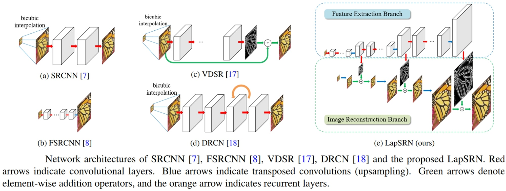

LapSRN is based on a cascade of CNNs. LapSRN takes an LR image as input and progressively predicts the sub-band residuals in a coarse-to-fine fashion. At each level, LapSRN first applies a cascade of convolutional layers to extract varied feature maps. Then a transposed convolutional layer is used for upsampling the feature maps to a finer level. Finally, a convolutional layer is employed to predict the sub-band residuals. The predicted residuals at each level are used to efficiently reconstruct the HR image through upsampling and addition operations. LapSRN generates multiple intermediate SR predictions in one feed-forward pass through progressive reconstruction using the Laplacian pyramid.

Examples of results obtained by the LapSRN model compared to the state-of-the-art methods are shown below.

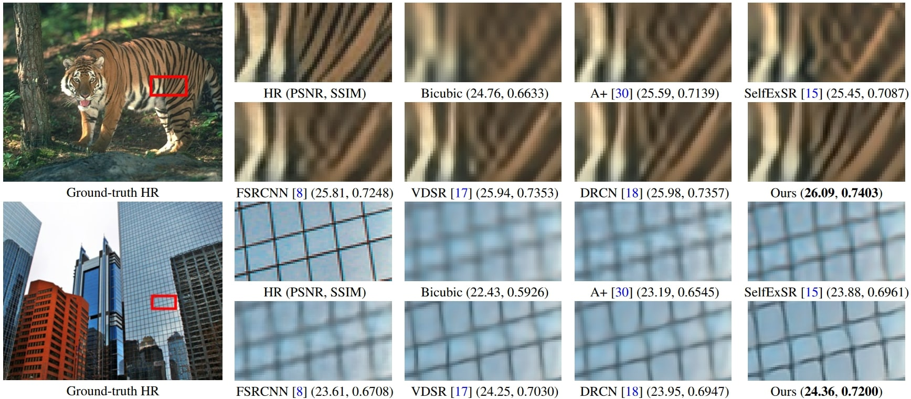

## Popular Architectures

### SRCNN

One of the earliest approaches to the SR problem using Deep Learning includes the [SRCNN](https://arxiv.org/pdf/1501.00092.pdf) (Super-Resolution Convolutional Neural Network) model proposed in 2015. SRCNN is a fully convolutional network, and the primary focus of the model was the simplicity of the architecture and fast processing speed.

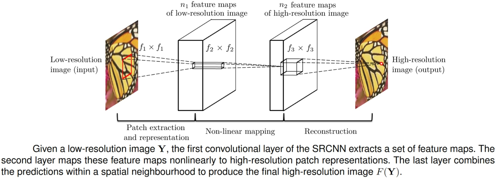

An overview of the SRCNN model is shown above. SRCNN produced better results with lesser computational costs as compared to the traditional SR methods that were popular at the time. A comparison of the results (both qualitative and quantitative) is shown below, where SRCNN was compared with Bicubic Interpolation and Sparse-Coding (SC) methods and some other state-of-the-art models at the time.

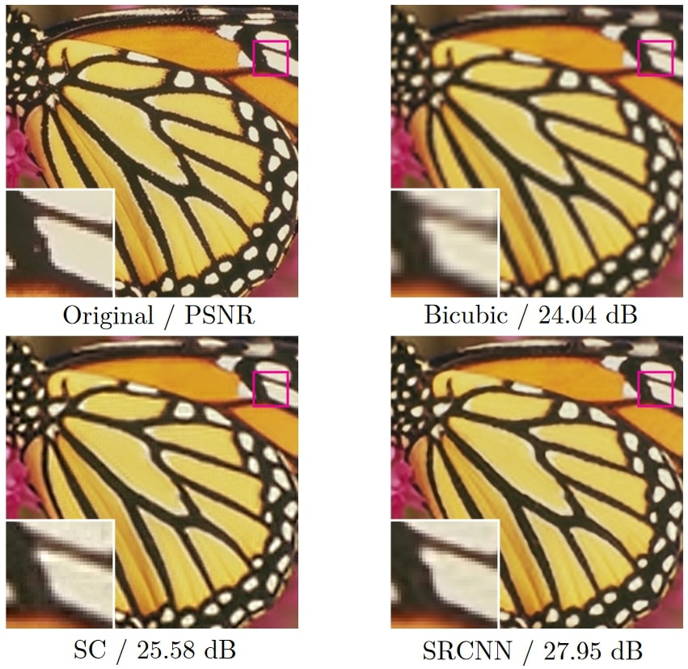

### SRGAN

The [SRGAN](https://arxiv.org/pdf/1609.04802.pdf) model, proposed in this paper, was a revolutionary model in the SR literature since it was the first method that could super-resolve photo-realistic natural images at 4x upsampling (an example of which is shown below).

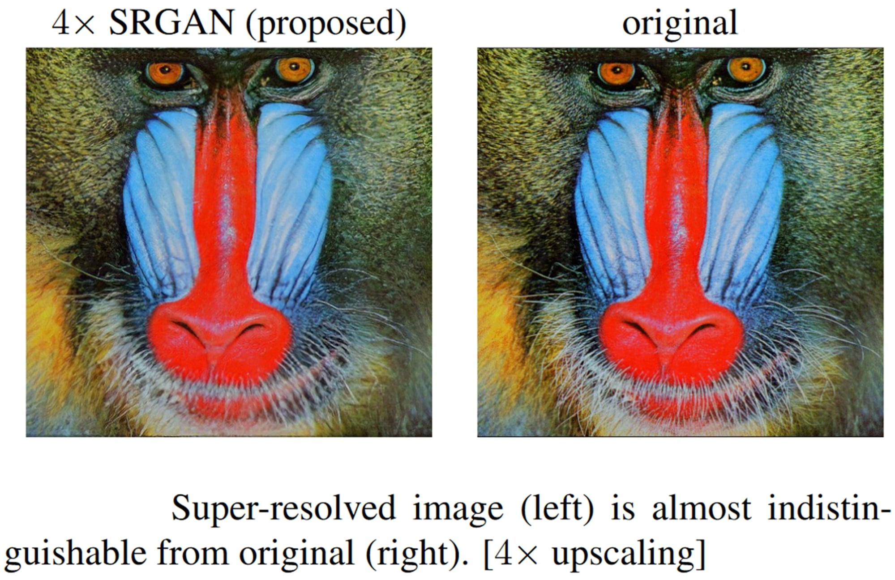

SRGAN is a Generative Adversarial Network-based (GAN) model that employs a deep (16 blocks) residual network with skip connections. While most SR approaches had used minimization of the Mean-Squared Error (MSE) as the only optimization target, SRGAN is optimized for a new [perceptual loss](https://cs.stanford.edu/people/jcjohns/papers/eccv16/JohnsonECCV16.pdf), enabling SRGAN to produce super-resolved images with high upscaling factors. SRGAN calculates the loss on the feature maps of a VGG Network instead of the traditional MSE loss. The architecture of SRGAN is shown below.

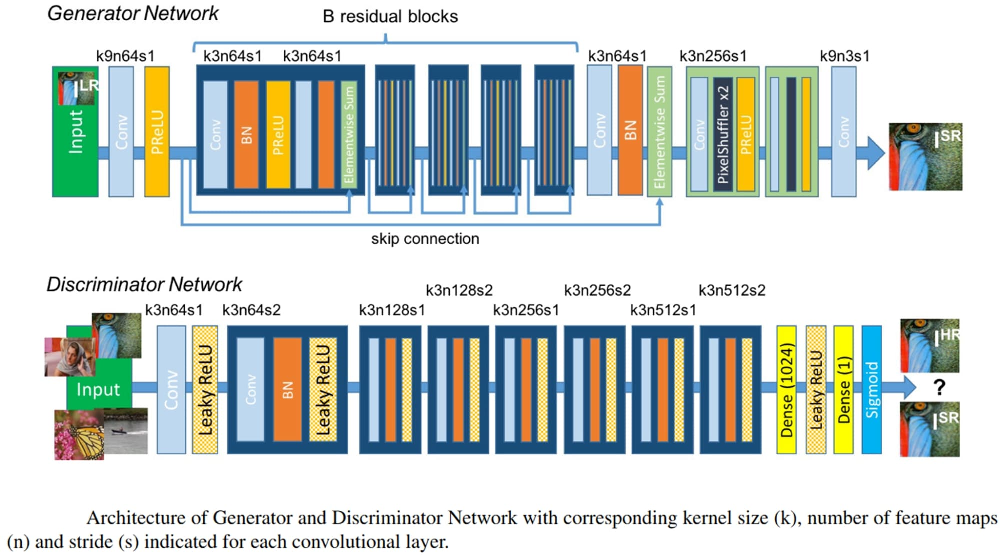

Some visual results obtained by the SRGAN model compared to other methods are shown below.

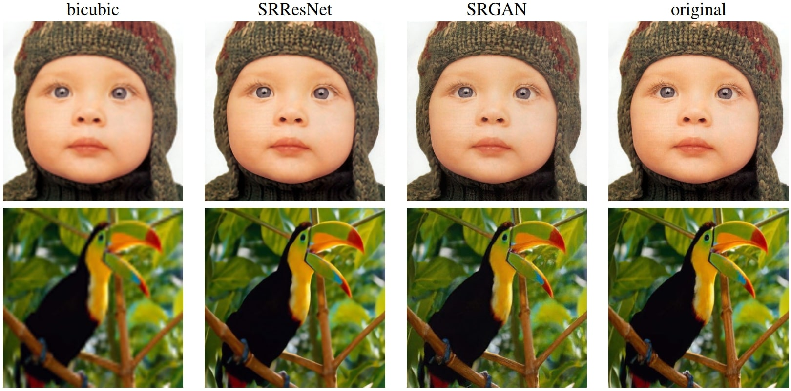

### ESPCN

[ESPCN](https://arxiv.org/pdf/1609.05158.pdf) is a Post Upsampling method of SR, where upscaling is handled by the last layer of the network, and super-resolution of the LR input to the HR image is accomplished from LR feature maps. To do this, the authors proposed an efficient sub-pixel convolution layer to learn the upscaling operation for image SR. This means that a convolution operation with a fractional stride is performed in the LR space. This activates different parts of the convolution filters depending on the location of the sub-pixels, which saves a lot of computational costs. The architecture of the ESPCN model is shown below.

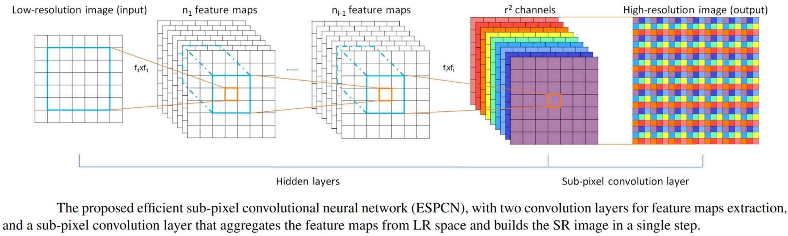

Some results obtained by the ESPCN model compared to the then state-of-the-art models (which use Pre Upsampling techniques) are shown below.

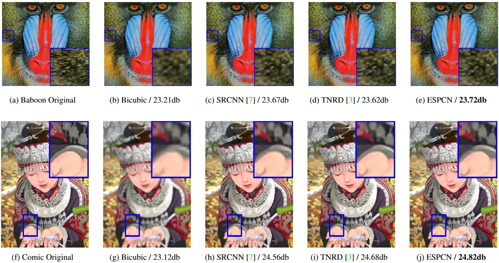

### SwinIR

[SwinIR](https://arxiv.org/pdf/2108.10257.pdf) is a recently proposed image reconstruction method that utilizes the widely popular [Swin Transformer](https://openaccess.thecvf.com/content/ICCV2021/papers/Liu_Swin_Transformer_Hierarchical_Vision_Transformer_Using_Shifted_Windows_ICCV_2021_paper.pdf) network, which integrates the advantages of both CNNs and Transformers. SwinIR consists of three modules: shallow feature extraction, which uses a single convolution layer that is directly transmitted to the reconstruction module to preserve low-frequency information; a deep feature extraction module which is mainly composed of residual Swin Transformer blocks, each of which utilizes several Swin Transformer layers for local attention and cross-window interaction; and finally, high-quality image reconstruction modules where both shallow and deep features are fused. The architecture of the SwinIR model is shown below.

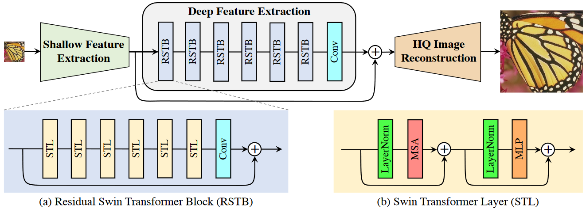

An example of visual results obtained by the SwinIR model compared to popular SR methods is shown below, which clearly showcases SwinIR’s superiority.

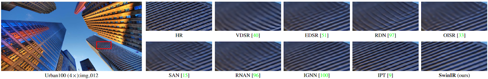

The most distinguishing feature about SwinIR is that it achieves state-of-the-art results while having up to 67% fewer parameters than most previous SR models.

## Low Supervision Methods

## References
