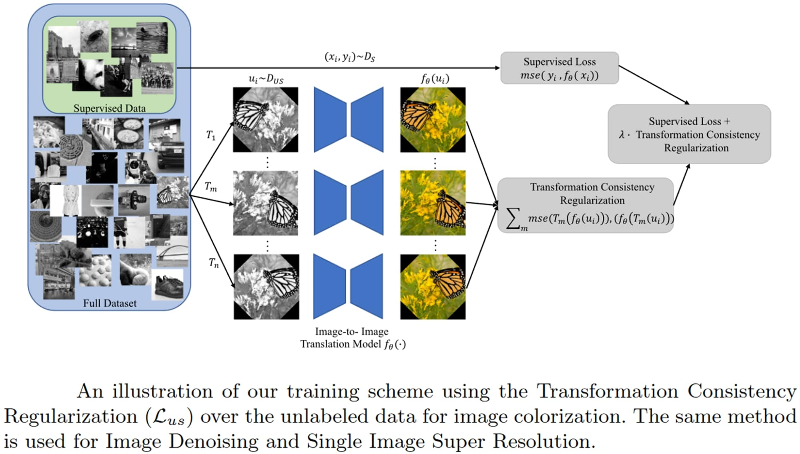
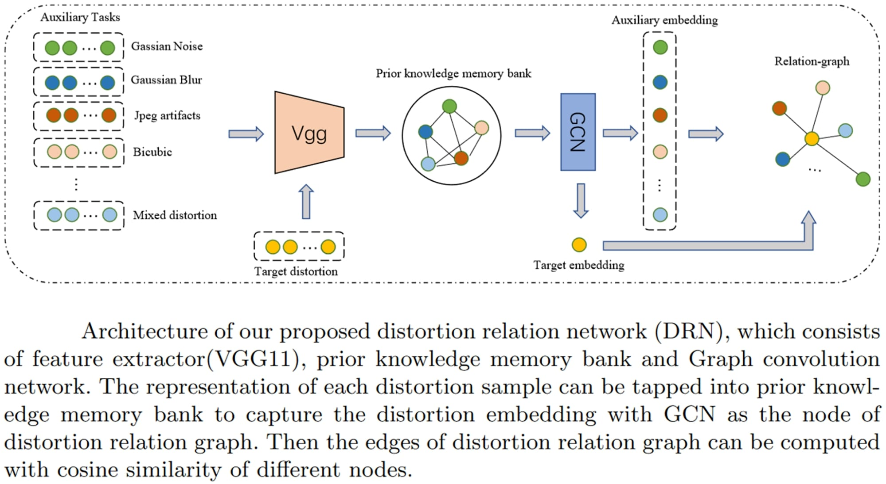
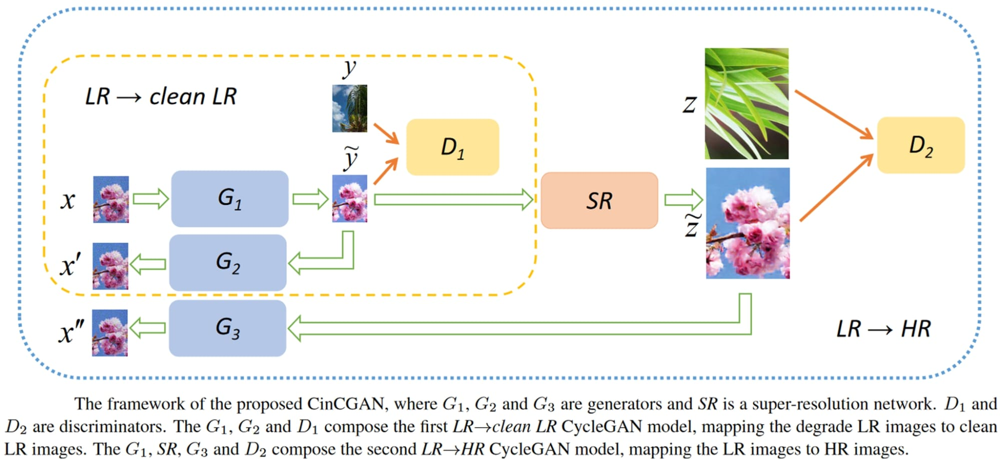
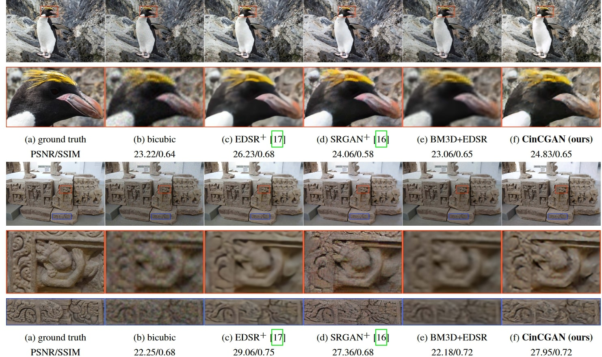

# Image Super Resolution

The resolution of an image is the number of pixels displayed per square inch (PPI) of a digital image. Super-Resolution (SR) refers to enhancing the resolution of an image from its low-resolution counterpart(s).

For example, when you zoom in on a digital image, you see that the image starts to blur. This is because the pixel density in the zoomed region is just linear interpolation which is not enough to represent a clear image.

Here’s an example of SR aiming to obtain the HR image when given an LR image:

Suppose an image is of resolution (i.e., the image dimensions) 64x64 pixels and is super-resolved to a resolution of 256x256 pixels. In that case, the process is known as 4x upsampling since the spatial dimensions (height and width of the image) are upscaled four times.

Now, a Low Resolution (LR) image can be modeled from a High Resolution (HR) image, mathematically, using a degradation function, delta, and a noise component, eta as the following:

In supervised learning methods, models aim to purposefully degrade the image using the above equation and use this degraded image as inputs to the deep model and the original images as the HR ground truth. This forces the model to learn a mapping between a low-resolution image and its high-resolution counterpart, which can then apply to super-resolve any new images during inference.

The first-ever image of the black hole, located millions of light-years away from us, was not technically *captured*. The information captured was super-resolved into the final image we have now. SR technology has passed its infant stage and is now being applied to areas like military, surveillance, biomedical imaging (especially in microscopic studies), etc. The recent focus of SR research is on reducing the need for labeled samples since we have already attained peak results using Supervised Learning.

## Single-Image vs. Multi-Image Super Resolution

Two types of Image SR methods exist depending on the amount of input information available. In single-image SR, only one LR image is available, which needs to be mapped to its high-resolution counterpart. In Multi-Image SR, however, multiple LR images of the same scene or object are available, which are all used to map to a single HR image.

In single-image SR methods, since the amount of input information available is low, fake patterns may emerge in the reconstructed HR image, which has no discernible link to the context of the original image. This can create ambiguity that can lead to the misguidance of the final decision-makers (scientists or doctors), especially in delicate application areas like bioimaging.

Intuitively, we can conclude that multi-image SR produces better performance since it has more information to work with. However, the computational cost in such cases also increases several-fold, making it infeasible in many application scenarios where there is a substantial resource constraint. Also, obtaining multiple LR images of the same object is tedious and impractical.

In most applications, Single-Image SR resembles real-world scenarios more closely. However, in some applications, like satellite imaging, multiple frames for the same scene (often at different exposures) are readily available, and thus Multi-Image SR is used extensively.

## Evaluation Techniques

Visual cues are not enough to evaluate and compare the performance of different SR methods since they are very subjective. A universal quantitative measure of SR performance is required to compare models reasonably.

[Peak Signal-to-Noise Ratio](https://en.wikipedia.org/wiki/Peak_signal-to-noise_ratio) (PSNR) and [Structural SIMilarity Index](https://en.wikipedia.org/wiki/Structural_similarity) (SSIM) are the two most commonly used evaluation metrics for evaluating SR performance. PSNR and SSIM measures are generally both used together for a fair evaluation of methods compared to the state-of-the-art.

### PSNR

Peak Signal-to-Noise Ratio or PSNR is an objective metric that measures the quality of image reconstruction of a lossy transformation. Mathematically it is defined by the following:

Here, MSE represents the pixel-wise Mean Squared Error between the images, and “M” is the maximum possible pixel value in an image (for 8-bit RGB images, we are used to M=255). The higher the value of PSNR (in decibels/dB), the better the reconstruction quality.

### SSIM

The Structural Similarity (SSIM) Index is a subjective measure that determines the structural coherence between two images (the LR and super-resolved HR images in this case). Mathematically it can be defined as follows:

SSIM ranges between 0 and 1, where a higher value indicates greater structural coherence and thus better SR capability.

## Learning Strategies

### Pre Upsampling

In this class of methods, the LR input image is first upsampled to meet the dimensions of the required HR output. Then processing is performed on the upscaled LR image using a Deep Learning model.

[VDSR](https://openaccess.thecvf.com/content_cvpr_2016/papers/Kim_Accurate_Image_Super-Resolution_CVPR_2016_paper.pdf) is an early attempt at the SR problem that uses the Pre Upsampling method. The VDSR network utilizes a very deep (20 weight layers) convolutional network (hence the name) inspired by VGG networks.

### Post Upsampling

Increasing the resolution of the LR images (in Pre Upsampling methods) before the image enhancement step increases the computational complexity. This is especially problematic for convolutional networks, where the processing speed directly depends on the input image resolution. Secondly, interpolation methods typically used to accomplish the task, such as bicubic interpolation, do not bring additional information to solve the ill-posed reconstruction problem.

Thus, in the Post Upsampling class of SR methods, the LR image is first processed for enhancement using a deep model and then upscaled using traditional techniques like bicubic interpolation to meet the HR image dimension criteria.

[FSRCNN](https://arxiv.org/pdf/1608.00367.pdf) is a popular SR model (an improvement to the [SRCNN](https://arxiv.org/pdf/1501.00092.pdf) model) that uses the Post Upsampling technique. In the FSRCNN architecture, feature extraction is performed in the LR space. FSRCNN also uses a 1x1 convolution layer after feature extraction to reduce the computational cost by reducing the number of channels.

Some results obtained by the FSRCNN model indicate that FSRCNN performs better than SRCNN while having a much lesser computational cost.

### Progressive Upsampling

Pre and Post Upsampling methods are both useful methods. However, for problems where LR images need to be upscaled by large factors (say 8x), regardless of whether the upsampling performs before or after passing through the deep SR network, the results are suboptimal. In such cases, it makes more sense to progressively upscale the LR image to finally meet the spatial dimension criteria of the HR output rather than upscaling by 8x in one shot. Methods that use this learning strategy are called Progressive Upsampling methods.

One such model is the [LapSRN](https://arxiv.org/pdf/1704.03915.pdf) or Laplacian Pyramid Super-Resolution Network architecture which progressively reconstructs the sub-band residuals of HR images. Sub-band residuals refer to the differences between the upsampled image and the ground truth HR image at the respective level of the network. LapSRN generates multiple intermediate SR predictions in one feed-forward pass through progressive reconstruction using the Laplacian pyramid.

## Popular Architectures

### SRCNN

One of the earliest approaches to the SR problem using Deep Learning includes the [SRCNN](https://arxiv.org/pdf/1501.00092.pdf) (Super-Resolution Convolutional Neural Network) model proposed in 2015. SRCNN is a fully convolutional network, and the authors mainly focus on the model simplicity and fast processing speed.

SRCNN produced better results with lesser computational costs than other traditional SR methods popular at the time.

### SRGAN

[SRGAN](https://arxiv.org/pdf/1609.04802.pdf) was a revolutionary model in the SR literature since it was the first method that could super-resolve photo-realistic natural images at 4x upsampling.

SRGAN is a Generative Adversarial Network-based (GAN) model that employs a deep (16 blocks) residual network with skip connections. While most SR approaches had used minimization of the Mean-Squared Error (MSE) as the only optimization target, SRGAN is optimized for a new [perceptual loss](https://cs.stanford.edu/people/jcjohns/papers/eccv16/JohnsonECCV16.pdf), enabling SRGAN to produce super-resolved images with high upscaling factors. SRGAN calculates the loss on the feature maps of a VGG Network instead of the traditional MSE loss.

### ESPCN

[ESPCN](https://arxiv.org/pdf/1609.05158.pdf) is a Post Upsampling method of SR, where the last layer of the network handles the upscaling, and super-resolution image is accomplished from the LR feature maps. To do this, the authors proposed an efficient sub-pixel convolution layer to learn the upscaling operation for image SR. This means that a convolution operation with a fractional stride is performed in the LR space. This activates different parts of the convolution filters depending on the location of the sub-pixels, which saves a lot of computational costs.

### SwinIR

[SwinIR](https://arxiv.org/pdf/2108.10257.pdf) is a recently proposed image reconstruction method that utilizes the widely popular [Swin Transformer](https://openaccess.thecvf.com/content/ICCV2021/papers/Liu_Swin_Transformer_Hierarchical_Vision_Transformer_Using_Shifted_Windows_ICCV_2021_paper.pdf) network, which integrates the advantages of both CNNs and Transformers. SwinIR consists of three modules: shallow feature extraction, which uses a single convolution layer that is directly transmitted to the reconstruction module to preserve low-frequency information; a deep feature extraction module which is mainly composed of residual Swin Transformer blocks, each of which utilizes several Swin Transformer layers for local attention and cross-window interaction; and finally, high-quality image reconstruction modules where both shallow and deep features are fused.

The most distinguishing feature of SwinIR is that it achieves state-of-the-art results while having up to 67% fewer parameters than most previous SR models.

## Low Supervision Methods

Most of the popular methods in SR use fully supervised learning to train large networks. However, such methods work reliably only when there is a large quantity of high-quality ground truth labels. Such large amounts of labeled data are challenging to obtain because data labeling is a time-consuming and costly operation. 80% of the total time spent on a supervised Machine Learning project goes towards data curating. Moreover, in medical SR tasks, it becomes costly since only expert doctors can annotate the data.

Thus, reducing the requirement of labeled data for solving the SR problem has been the focus of researchers in the last few years. Although not always as good as supervised approaches, such low supervision methods yield excellent results.

### Semi-Supervised Methods

Semi-Supervised Learning is a paradigm where, in a large dataset, only a small percentage of data is labeled. That is, deep models have access to a large amount of unstructured data along with a small set of labeled data to train the network.

One such approach was proposed in this [paper](https://link.springer.com/chapter/10.1007/978-3-030-58523-5_35), where the authors used only 10-20% labeled data. The authors taking insights from the Consistency Regularization literature, introduce a regularization term over the unsupervised data called Transformation Consistency Regularization (TCR), which makes sure the model’s prediction for a geometric transform of an image sample is consistent with the geometric transformation of the model’s reconstruction of the image.

### Few-Shot Methods

Few-Shot Learning is a meta-learning mechanism (meta-learning means learning to learn) where a pre-trained model is extended to new data patterns by using only a handful of labeled samples. This [paper](https://arxiv.org/pdf/2111.13078.pdf) introduced Few-Shot Learning in the SR problem for the first time, where they used graphical modeling.

The authors introduced a Distortion Relation Network (DRN) to learn the expected distortion-relation embeddings. To make the DRN general for arbitrary image SR, they designed a prior knowledge memory bank to store the learnable distortion-relation from seen auxiliary tasks (i.e., synthetic distortions using degradation functions). Thus, given an arbitrary real distorted sample, it can traverse the prior knowledge memory bank to acquire the needed distortion embeddings.

Then similarities between the distortions are drawn using cosine similarity, and a “Distortion-Relation guided Transfer Learning” (DRTL) network proposed by the authors is used for obtaining the final super-resolved output.

### Unsupervised Methods

One method that tackles this problem is the [CinCGAN](https://openaccess.thecvf.com/content_cvpr_2018_workshops/papers/w13/Yuan_Unsupervised_Image_Super-Resolution_CVPR_2018_paper.pdf) model, which utilizes a Cycle-in-Cycle structure inspired by the popular [CycleGAN](https://arxiv.org/pdf/1703.10593.pdf) model. In CycleGAN, the dimensions of the input and output images are the same, which is not the case in SR problems.

CinCGAN consists of two CycleGANs where the first CycleGAN maps the LR input image to the clean and bicubic downsampled LR space. Then a pre-trained deep model with a bicubic downsampling assumption is stacked on top of it to up-sample the intermediate result to the desired size. The entire first CycleGAN model acts as one of the generators of the second CycleGAN model. Adversarial Learning is used to fine-tune the entire network.

The yellow dotted lines above show the first CycleGAN module, which acts as a generator for the second CycleGAN model. Some results obtained by the CinCGAN model are shown below. The unsupervised approach yields results that are, on occasion, even better than fully supervised approaches.

## References

1. [Deep Learning for Image Super-Resolution](https://www.v7labs.com/blog/image-super-resolution-guide)
