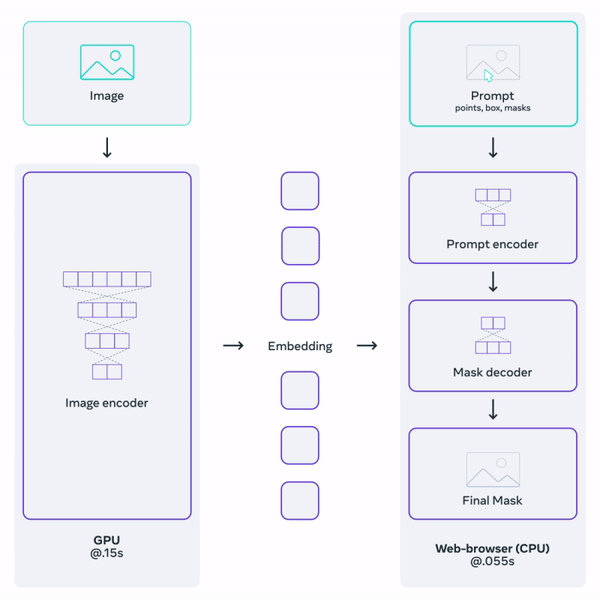
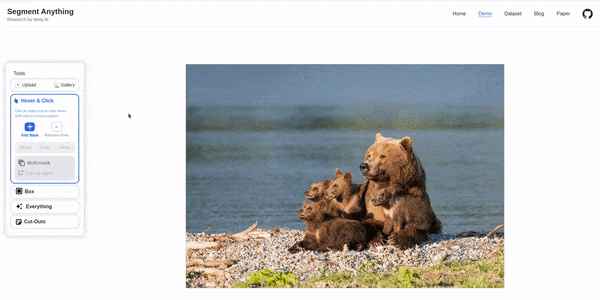
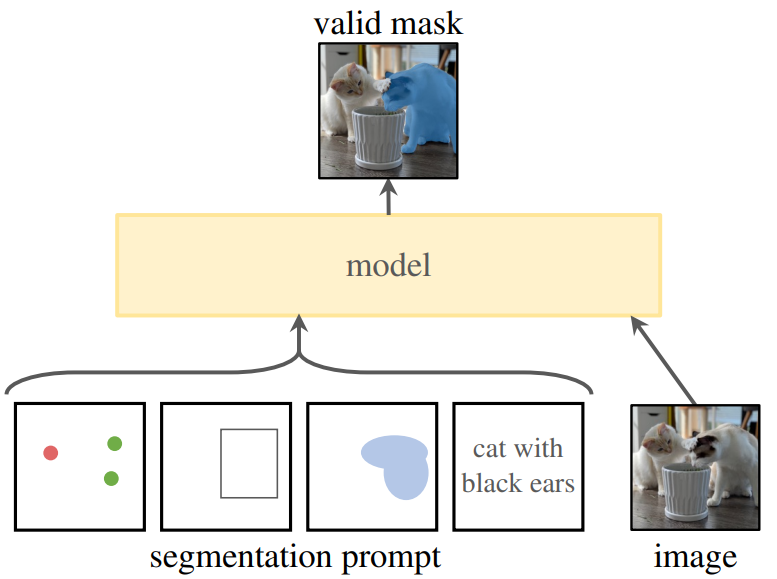
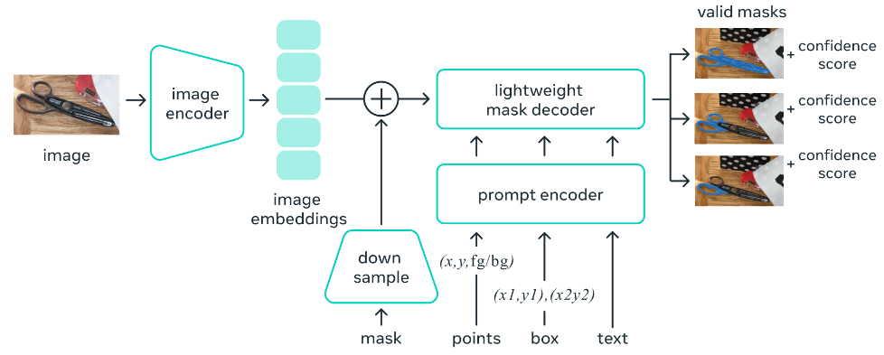

# Segment Anything – A Foundation Model for Image Segmentation

Foundation models in Artificial Intelligence are becoming increasingly important. The term started picking up pace in the field of NLP and now, with the Segment Anything Model, they are slowly getting into the world of computer vision. Segment Anything is a project by Meta to build a starting point for foundation models for image segmentation.

## Table of Contents

- [Segment Anything – A Foundation Model for Image Segmentation](#segment-anything--a-foundation-model-for-image-segmentation)
  - [Table of Contents](#table-of-contents)
  - [What is the Segment Anything Project?](#what-is-the-segment-anything-project)
  - [Segment Anything Model (SAM)](#segment-anything-model-sam)
  - [SAM Architecture](#sam-architecture)
    - [Image Encoder](#image-encoder)
    - [Prompt Encoder](#prompt-encoder)
  - [Segment Anything Dataset](#segment-anything-dataset)
  - [Models available](#models-available)
  - [Inference using SAM](#inference-using-sam)
  - [References](#references)

## What is the Segment Anything Project?

Segment Anything is a new project by Meta to build two major components:

- A large dataset for image segmentation
- The Segment Anything Model (SAM) as a promptable foundation model for image segmentation

It was introduced in the [Segment Anything paper](https://arxiv.org/abs/2304.02643) by Alexander Kirillov et al.

The Segment Anything project aims to democratize the world of image segmentation and provide a starting point to solve multiple problems. In both science and artificial intelligence, image segmentation has several potential uses. These include analyzing biomedical images, editing photos, autonomous driving, etc.

## Segment Anything Model (SAM)

The earlier deep-learning approaches required specialized training data collection, manual annotation, and hours of training. Such approaches work well but require substantial amounts of retraining the model when changing the dataset.

With SAM, we now have a generalizable and promptable image segmentation model that can cut out almost anything from an image. SAM is a transformer-based deep learning model, it has been trained on a vast amount of images and masks – more than 1 billion masks in 11 million images.

SAM can take prompts from users about which area to segment out precisely. As of the current release, we can provide three different prompts to SAM:

- By clicking on a point
- By drawing a bounding box
- By drawing a rough mask on an object

If, for some reason, SAM does not feel confident about outputting the mask of an object, it will attempt to segment *other parts of that object*. This method (known as multi-masking) allows SAM to output multiple valid masks when the object is ambiguous.

## SAM Architecture

There are three components of the model:

- An image encoder
- A prompt encoder
- A mask decoder

When we give an image as input to the Segment Anything Model, it first passes through an image encoder and produces a one-time embedding for the entire image.

There is also a prompt decoder for **points**, **boxes**, or **text as prompts**. For points, the **x & y** coordinates along with the foreground and background information become input to the encoder. For boxes, the bounding box coordinates become the input to the encoder, and as for the text (not released at the time of writing this), the tokens become the input.

In case we provide a mask as input, it goes through a downsampling stage. The downsampling happens using 2D convolutional layers. Then the model concatenates it with the image embedding to get the final vector.

Any vector the model gets from the prompt vector + image embedding passes through a lightweight decoder to create the final segmentation mask.

We get possible valid masks along with a confidence score as the output.

### Image Encoder

The image encoder is one of the most powerful and essential components in SAM. It is based on an MAE pre-trained **Vision Transformer** model. But to keep the performance real-time in browsers, trade-offs have been made.

### Prompt Encoder

For the prompt encoder, points, boxes, and text act as sparse inputs, and masks act as dense inputs. The creators of SAM represent points and bounding boxes using positional encodings and sum it with learned embeddings. For text prompts, SAM uses the text encoder from CLIP. For masks as prompts, after downsampling through convolutional layers, the embedding is summed element-wise with the input image embedding.

## Segment Anything Dataset

The Segment Anything Dataset contains more than **11 million images** and **1.1 billion masks**. The final dataset is called *SA-1B dataset*.

Such a dataset is needed to train a model of Segment Anything capability. But we also know that such datasets do not exist, and manually annotating so many images is impossible.

**So, how was the dataset curated?**

In short, SAM helped in annotating the dataset. The data annotators used SAM to annotate images interactively, and new annotation data was then used to train SAM. This process was repeated, which created the SAM's in-loop data engine.

This data engine + training the SAM on the dataset has three stages:

- Assisted-Manual Stage
- Semi-Automatic Stage
- Fully Automatic Stage

In the first stage, the annotators used a pretrained SAM model to interactively segment objects in images using a browser. The image embeddings were precomputed to make the annotation process seamless and real-time. After the first stage, the dataset consisted of **4.3 million masks** from **120k images**. The Segment Anything Model was retrained on this dataset.

In the second semi-automatic stage, the prominent objects were segmented using SAM. The annotators additionally annotated less prominent objects which were unannotated. This stage resulted in an additional **5.9M masks** from **180k images** on which SAM was retrained.

In the final *fully automatic stage*, the annotation was done entirely by SAM. By this stage, it had already been trained on more than 10M masks which made it possible. **Automatic mask generation was applied on 11M images resulting in 1.1B masks.**

The final version of the Segment Anything Dataset makes it the largest publicly available image segmentation dataset. Compared to [OpenImages V7](https://storage.googleapis.com/openimages/web/index.html), there are 6x more images and 70x more masks.

## Models available

As of now, there are model weights available for three different scales of Vision Transformer models.

- [ViT-B SAM](https://dl.fbaipublicfiles.com/segment_anything/sam_vit_b_01ec64.pth)
- [ViT-L SAM](https://dl.fbaipublicfiles.com/segment_anything/sam_vit_l_0b3195.pth)
- [ViT-H SAM](https://dl.fbaipublicfiles.com/segment_anything/sam_vit_h_4b8939.pth)

## Inference using SAM

## References

1. [OpenCV blog](https://learnopencv.com/segment-anything/)
2. [Segment Anything](https://segment-anything.com/)
3. [Segment Anything github](https://github.com/facebookresearch/segment-anything)
4. [Segment Anything paper](https://arxiv.org/abs/2304.02643)
