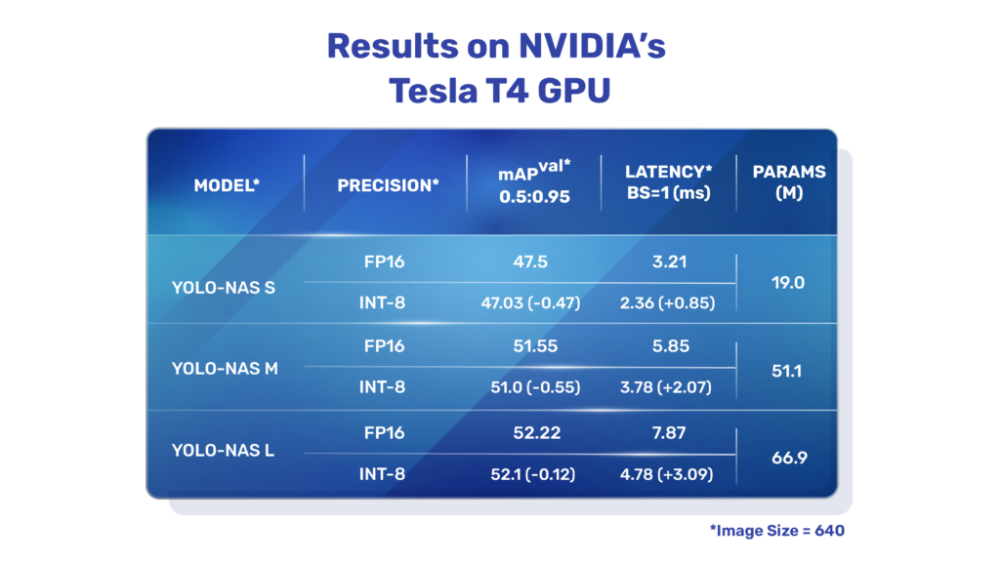
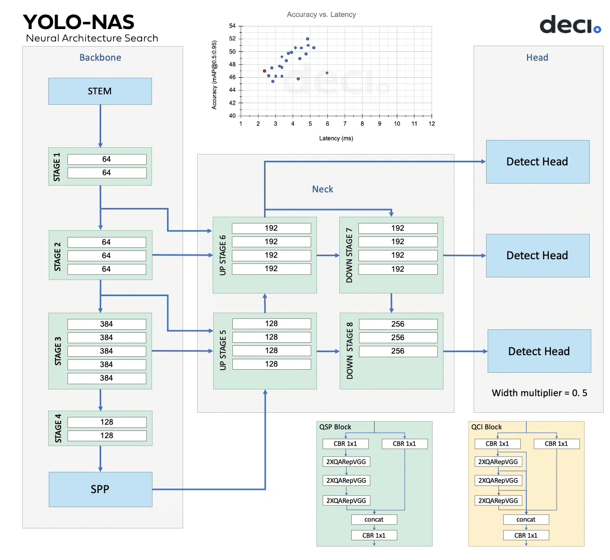
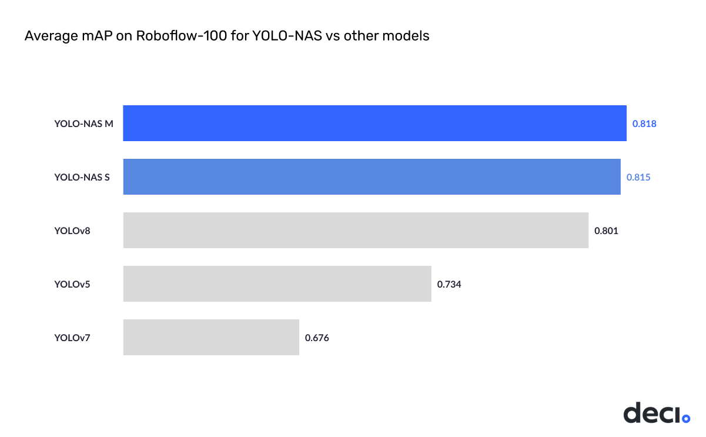

# Yolo-NAS: Neural Architecture Search YOLO

Developing a new YOLO-based architecture can redefine state-of-the-art (SOTA) object detection by addressing the existing limitations and incorporating recent advancements in deep learning. Deep learning firm Deci.ai has recently launched **YOLO-NAS**. This deep learning model delivers superior real-time object detection capabilities and high performance ready for production. These YOLO-NAS models were constructed using Deci’s AutoNAC™ NAS technology and outperformed models like YOLOv7, and YOLOv8, including the recently launched YOLOv6-v3.0 in terms of mAP (mean average precision) and inference latency.

YOLO-NAS is a new foundational model for object detection from Deci.ai. The team has incorporated recent advancements in deep learning to seek out and improve some key limiting factors of current YOLO models, such as inadequate quantization support and insufficient accuracy-latency tradeoffs. In doing so, the team has successfully pushed the boundaries of real-time object detection capabilities.

Currently, the YOLO-NAS model architectures are available under an open-source license, but the pre-trained weights are available for research use (non-commercial) on Deci’s [SuperGradients](https://github.com/Deci-AI/super-gradients) library only.

The “NAS” stands for “Neural Architecture Search,” a technique used to automate the design process of neural network architectures. Instead of relying on manual design and human intuition, NAS employs optimization algorithms to discover the most suitable architecture for a given task. NAS aims to find an architecture that achieves the best trade-off between accuracy, computational complexity, and model size.

## Key Architectural Insights into YOLO-NAS

- The architectures of YOLO-NAS models were “found” using Deci’s proprietary NAS technology, [AutoNAC](https://deci.ai/technology/). This engine was used to ascertain the optimal sizes and structures of stages, encompassing block type, the number of blocks, and the number of channels in each stage.
- In all, there were 1014 possible architecture configurations in the NAS search space. Being hardware and data-aware, the AutoNAC engine considers all the components in the inference stack, including compilers and quantization, and honed into a region termed the “efficiency frontier” to find the best models. All three YOLO-NAS models were found in this region of the search space.
- Throughout the NAS process, Quantization-Aware RepVGG (QA-RepVGG) blocks are incorporated into the model architecture, guaranteeing the model’s compatibility with Post-Training Quantization (PTQ).
- Using quantization-aware “QSP” and “QCI” modules consisting of QA-RepVGG blocks provide 8-bit quantization and reparameterization benefits, enabling minimal accuracy loss during PTQ.
- The researchers also use a hybrid quantization method that selectively quantizes specific layers to optimize accuracy and latency tradeoffs while maintaining overall performance.
- YOLO-NAS models also use attention mechanisms and inference time reparametrization to improve object detection capabilities.

## Brief Summary Training of YOLO-NAS Models

1. The models were pre-trained on the famous Object365 benchmark dataset. A dataset consisting of 2M images and 365 categories.
2. Another pretraining round after “pseudo-labeling” 123k COCO unlabeled images.
3. Knowledge Distillation (KD) & Distribution Focal Loss (DFL) were also incorporated to enhance the training process of YOLO-NAS models.

After the models were pre-trained, as an experiment, the team decided to test the performance on RoboFlow’s [RoboFlow100 dataset](https://blog.roboflow.com/roboflow-100/) to demonstrate its ability to handle complex object detection tasks. Needless to say, YOLO-NAS outperformed other YOLO versions by a considerable margin.

## How To Use YOLO-NAS For Inference?

YOLO-NAS models have been tightly coupled and available with [SuperGradients](https://github.com/Deci-AI/super-gradients), Deci’s PyTorch-based, open-source, computer vision training library. In effect, using these models is really easy.

You can view and run some example notebooks inside `notebooks` folder.

### Kaggle notebooks

## References

1. [YOLO-NAS by Deci Achieves State-of-the-Art Performance on Object Detection Using Neural Architecture Search](https://deci.ai/blog/yolo-nas-object-detection-foundation-model/)
2. [SuperGradients github](https://github.com/Deci-AI/super-gradients)
