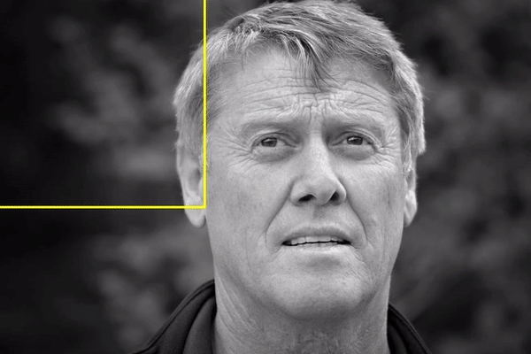

# SAHI: Slicing Aided Hyper Inference for Small Object Detection

**Small object detection** refers to the task of **identifying** and **localizing** objects that are relatively small in size within digital images. These objects typically have limited spatial extent and low pixel coverage, such as those with sizes ranging from a few pixels to a specific threshold.

## Applications of Small Object Detection

Accurate detection of small objects holds immense importance in various fields, enabling advancements in numerous applications. Some notable applications include:

- **Surveillance and Security**: Identification and tracking of small objects in crowded areas for enhanced public safety. This includes detecting and monitoring suspicious activities or individuals in surveillance footage.
- **Autonomous Driving**: Small object detection plays a vital role in ensuring safe navigation for autonomous vehicles. Accurately detecting pedestrians, cyclists, and traffic signs in real-time help prevent accidents and ensures efficient transportation.
- **Medical Imaging**: In medical imaging, detecting and localizing abnormalities and lesions in small structures is vital for early disease diagnosis and treatment planning. Accurate small object detection aids in improving patient outcomes and optimizing healthcare practices.
- **Remote Sensing and Aerial Imagery**: Identification of small objects in satellite imagery facilitates various applications, such as urban planning and environmental monitoring.
- **Industrial Inspection**: Quality control and defect detection are critical in manufacturing processes to ensure high product quality. Small object detection enables the identification of minor flaws or anomalies that may impact product performance or safety.
- M**icroscopy and Life Sciences**: Analysis of cellular structures and microorganisms for research in biology and genetics.
- **Robotics and Object Manipulation**: Accurate detection of small objects is essential for effective robotic object manipulation in automation tasks. Robots equipped with small object detection capabilities can handle intricate tasks, such as assembling miniature components or performing delicate operations.

## Small Object Detection challenges

Despite the advancements in object detection algorithms, detecting small objects remains a challenging task. Here are some key challenges that arise when applying existing models to small object detection:

### Limited Receptive Field

The receptive field refers to the **spatial extent** of the input image that influences the output of a particular neuron or filter in a convolutional neural network (CNN). In traditional object detectors, the receptive field may be limited, resulting in a restricted understanding of the contextual information surrounding smaller objects. Therefore, the detector has difficulty in accurately detecting and locating these objects due to the inadequate receptive field.

### Features Representation

Object detectors typically rely on learned features within CNN architectures to recognize objects. However, the inherent limitations of feature representation may **hinder the detection** of smaller objects. The learned features may not sufficiently capture the intricate details of small objects, making it difficult to differentiate them from the background or other similar-looking objects.

### Scale Variation

Small objects exhibit significant scale variations compared to larger objects within an image. Object detectors trained on datasets predominantly consisting of larger objects, such as ImageNet or COCO, may **struggle to generalize** too small objects due to the discrepancy in scale. The variations in size can lead to difficulties in matching the learned object representations, resulting in decreased detection performance for smaller objects.

### Training Data Bias

Object detection models are typically trained on large-scale datasets, which may **contain biases toward larger objects** due to their prevalence. This bias can result in reduced exposure to diverse instances of small objects. Consequently, the model may lack the necessary robustness and accuracy when it comes to detecting smaller object instances.

### Localization Challenges

Localizing smaller objects accurately can be challenging due to the **limited spatial resolution** of feature maps within CNN architectures. The fine-grained details required for precise localization may be lost or become indistinguishable at lower resolutions. Furthermore, small objects are more susceptible to occlusion by larger objects or cluttered backgrounds, exacerbating the localization challenges. These factors contribute to the limitations of normal object detectors in accurately localizing and detecting smaller objects.

## Existing approaches for Small Object Detection

Several techniques have been developed in the field of computer vision. These approaches employ various strategies and algorithms to improve detection performance specifically for smaller objects. Here are some commonly employed methods:

### Image pyramid

It involves the creation of **multiple scaled versions** of the input image by *down-sampling* or *up-sampling*. These scaled versions, or pyramid levels, provide different image resolutions. Object detectors can apply the detection algorithm at each pyramid level to handle objects at different scales. This approach allows the detection of small objects by searching for them at lower pyramid levels, where they may be more prominent and distinguishable.

### Sliding Window Approach

This method involves **sliding a fixed-sized window** across the image at various positions and scales. At each window position, the object detector applies a classification model to determine the presence of an object. By considering different window sizes and positions, the detector effectively searches for small objects throughout the image. However, the sliding window approach can be computationally expensive, especially when dealing with large images or multiple scales.

### Multi-scale Feature Extraction

Object detectors can utilize multi-scale feature extraction techniques to capture information at different levels of detail. This involves processing the image at **multiple resolutions** or **applying convolutional layers** with different receptive fields. By incorporating features from different scales, the detector can effectively capture both small and large objects in the scene. This approach helps preserve fine-grained details relevant to detecting small objects and enhances the detector's performance.

### Data Augmentation

Data augmentation is a widely used technique in computer vision that can significantly enhance the detection performance of small objects. Augmentation methods like random cropping, resizing, rotation, or introducing artificial noise can help enrich the dataset with variations, allowing the detector to learn robust features for small objects. Augmentation techniques can also simulate different object scales, perspectives, and occlusions, helping the detector generalize better to real-world scenarios.

### Transfer Learning

This method involves leveraging **knowledge learned** from pretraining on large-scale datasets (e.g., ImageNet) and applying it to object detection tasks. Pretrained models, especially those with deep convolutional neural network (CNN) architectures, capture rich hierarchical features that are beneficial for small object detection. By fine-tuning pre-trained models on target datasets, object detectors can quickly adapt to new scenarios, using the learned representations and enabling better detection of small objects.

## Slicing Aided Hyper Inference: Revolutionary Pipeline for Small Object Detection

SAHI introduces a groundbreaking pipeline for small object detection, leveraging slicing-aided inference and fine-tuning techniques. What sets SAHI apart is its seamless integration with any object detector, eliminating the need for tedious fine-tuning while maintaining exceptional performance.

Incredible experimental evaluations conducted on the [Visdrone](https://github.com/VisDrone/VisDrone-Dataset) and [xView](http://xviewdataset.org/) datasets showcase the unparalleled effectiveness of SAHI. Without making any modifications to the detectors themselves, SAHI elevates object detection average precision (AP) by a remarkable **6.8%** for FCOS, **5.1%** for VFNet, and **5.3%** for TOOD (Task-Aligned One-Stage Object Detection) detectors.

But SAHI doesn't stop there. It also introduces a groundbreaking slicing-aided fine-tuning technique, taking detection accuracy to a new level. By fine-tuning the models, the cumulative gains in AP soared to an astonishing **12.7%** for FCOS, **13.4%** for VFNet, and **14.5%** for TOOD detectors.

### Slicing Aided Fine Tuning

- Augment the fine-tuning dataset by extracting patches from images.
- Slice each image into overlapping patches with dimensions **M x N**, selected from predefined ranges [Mmin, Mmax] and [Nmin, Nmax] as hyperparameters.
- During fine-tuning, resize the patches while maintaining the aspect ratio.
- The resized patches create augmentation images, increasing the relative size of objects compared to the original image.
- Utilize the original images during the fine-tuning process to effectively detect large objects.

### Slicing Aided Hyper Inference

- Divide the original query image into overlapping patches with dimensions M × N.
- Resize each patch while maintaining the aspect ratio and perform an independent object detection forward pass.
- Additionally, perform a full inference step using the original image to detect larger objects.
- Merge the prediction results from the overlapping patches and, if applicable, the results from the full inference step using **Non-Maximum Suppression** (NMS).
- During NMS, consider boxes with **Intersection over Union** (IoU) ratios higher than a predefined matching threshold as matches. Discard results with detection probabilities lower than a threshold to retain the most confident and non-overlapping detections.

## Conculsions

The introduction of the Slice Aided Hyper Inference (SAHI) framework marks a significant milestone in small object detection. With its innovative pipeline, seamless integration with any object detector, and remarkable performance improvements, SAHI has revolutionized how we detect and identify small objects.

The impact of SAHI on the object detection field will continue to unfold as researchers and practitioners leverage its capabilities to push the boundaries of visual perception. The future of small object detection is bright, with SAHI leading the way.

## References

1. [Slicing Aided Hyper Inference and Fine Tuning for Small Object Detection](https://ieeexplore.ieee.org/document/9897990)
2. [SAHI Repository](https://github.com/obss/sahi)
