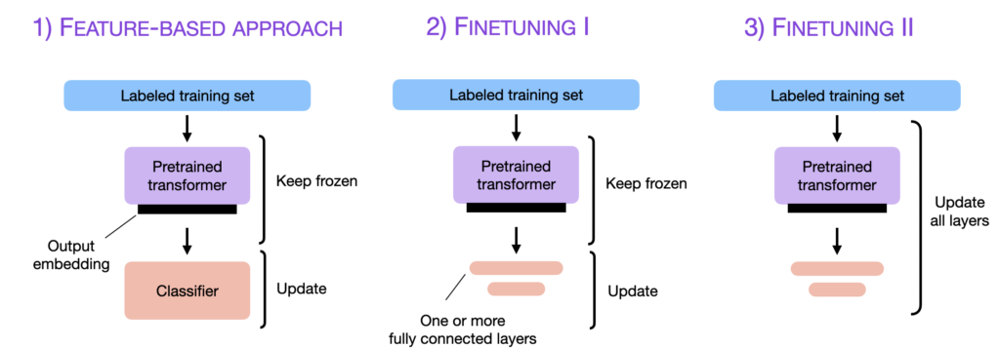
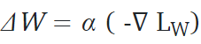
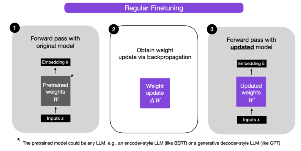
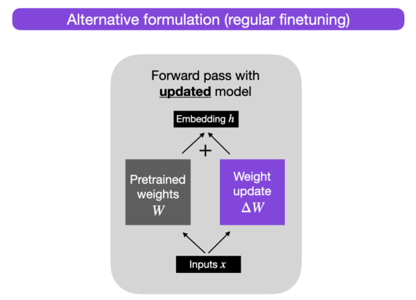
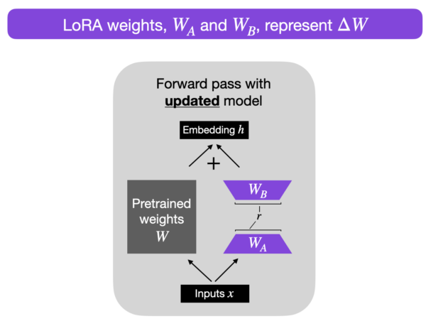
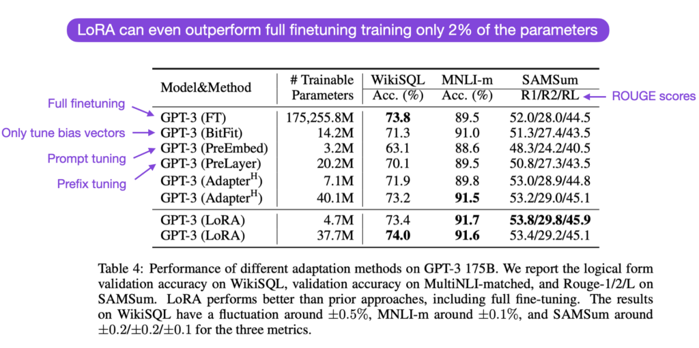

# LoRA: Parameter-Efficient LLM Finetuning With Low-Rank Adaptation

Training and fine-tuning large language models (LLMs) have traditionally been resource-intensive tasks. It was widely believed that only models with hundreds of billions of parameters, trained using immense computational power and costly infrastructure, could match the capabilities of renowned LLMs like GPT-3.5 and ChatGPT.

However, recent advancements in the field have challenged this notion. Open-source LLMs with a significantly smaller parameter count have demonstrated remarkable performance, proving that we don't necessarily require massive models to achieve state-of-the-art results. Researchers have successfully fine-tuned LLMs with just a few million parameters, achieving comparable performance to their larger counterparts. This has sparked tremendous interest and activity in the field, further pushing the boundaries of what's possible.

Pretrained large language models are often referred to as foundation models for a good reason: they exhibit strong performance across various tasks and serve as a starting point for fine-tuning on specific target tasks. However, updating the layers of these models can be computationally expensive, especially as the model size increases.



To address this challenge, several parameter-efficient methods have been developed as alternatives to updating all layers. Two popular techniques are prefix tuning (refer to [Li et al., 2021](https://arxiv.org/abs/2101.00190)) and adapters (refer to [Houlsby et al., 2019](https://arxiv.org/abs/1902.00751)). These methods aim to minimize the computational costs associated with fine-tuning.

Now, a new parameter-efficient finetuning technique has emerged, known as Low-rank adaptation (LoRA) introduced by [Hu et al., 2023](https://arxiv.org/abs/2106.09685). LoRA provides an innovative approach to achieve efficient parameter updates while maintaining high performance.

In the subsequent sections, we will delve deeper into the concepts and techniques behind LoRA, exploring how it can enable more cost-effective and streamlined fine-tuning of large language models.

## How does fine-tuning work?

In a neural network, the weight matrix of a given layer is denoted as W. During fine-tuning, the weight update ΔW is calculated using regular backpropagation. Typically, this update is obtained by taking the negative gradient of the loss multiplied by the learning rate, as shown in the equation below:



Once we have ΔW, we update the original weights as W' = W + ΔW. The figure below illustrates this process, we omit bias vectors for simplicity.



Alternatively, we can keep the weight update matrix separate and compute the outputs as follows: `h = Wx + ΔWx`, where x represents the inputs, as illustrated below.



## Low-rank adaption (LoRA)

Before delving into LoRA, let's consider model parameters as large matrices. In linear algebra, matrices form vector spaces, and in this case, we have a high-dimensional vector space representing language models.

Every matrix has a **rank**, which indicates the number of linearly independent columns it contains. Linear independence means that a column cannot be expressed as a combination of other columns in the matrix. Conversely, dependent columns can be represented using other columns. Removing dependent columns from a matrix does not result in any loss of information.

While pretrained models have full-rank weight matrices for their pretrained tasks, the authors of LoRA point out that when adapting these models to new tasks, they exhibit a low [intrinsic dimension](https://arxiv.org/abs/2012.13255). This suggests that we can preserve most of the model's learning capacity while reducing the dimensionality of the downstream parameters. In other words, we can decompose the weight matrix for the adapted task into lower-dimensional matrices without significant loss of important information.

For example, let's consider a weight update ΔW for an A × B weight matrix. We can decompose the weight update matrix into two smaller matrices: `ΔW = W_A W_B`, where W_A is an A × r-dimensional matrix, and W_B is an r × B-dimensional matrix. In this approach, the original weight matrix W remains frozen, and we only train the new matrices W_A and W_B. This, in essence, is the LoRA method, as depicted in the figure below.



### Choosing the rank

In the LoRA method, the rank `r` is a hyperparameter that determines the dimensionality of the low-rank matrices used for adaptation. Choosing the appropriate rank is essential as it influences various aspects of the adaptation process.

A smaller value of `r` corresponds to simpler low-rank matrices, reducing the number of parameters to learn during adaptation. This can result in faster training and potentially lower computational requirements. However, a smaller rank also means a reduced capacity of the low-rank matrices to capture task-specific information. Consequently, the adaptation quality may suffer, and the model might not perform as well on the new task compared to using a higher rank.

In summary, choosing a smaller `r` in LoRA involves a trade-off between model complexity, adaptation capacity, and the risk of underfitting or overfitting. It is crucial to experiment with different r values to find the right balance that achieves the desired performance on the new task.

### Implementing LoRA

The implementation of LoRA is relatively straightforward and involves modifying the forward pass for the fully connected layers in a large language model. Here is a pseudo-code representation of the implementation:

```python

input_dim = 768  # e.g., the hidden size of the pre-trained model
output_dim = 768  # e.g., the output size of the layer
rank = 8  # The rank 'r' for the low-rank adaptation

W = ... # from pretrained network with shape input_dim x output_dim

W_A = nn.Parameter(torch.empty(input_dim, rank)) # LoRA weight A
W_B = nn.Parameter(torch.empty(rank, output_dim)) # LoRA weight B

# Initialization of LoRA weights
nn.init.kaiming_uniform_(W_A, a=math.sqrt(5))
nn.init.zeros_(W_B)

def regular_forward_matmul(x, W):
    h = x @ W
return h

def lora_forward_matmul(x, W, W_A, W_B):
    h = x @ W  # regular matrix multiplication
    h += x @ (W_A @ W_B)*alpha # use scaled LoRA weights
return h
```

In the pseudo-code above, `alpha` is a scaling factor that adjusts the magnitude of the combined result (original model output plus low-rank adaptation). This balance ensures that the pretrained model's knowledge and the new task-specific adaptation are appropriately incorporated. By default, `alpha` is usually set to 1. Additionally, note that W_A is initialized with small random weights, while W_B is initialized with zeros, ensuring `ΔW = W_A @ W_B = 0` at the beginning of the training, meaning we begin the training with the original weights.

### Parameter efficiency

One might question the parameter efficiency of LoRA due to the introduction of new weight matrices. The new matrices, W_A and W_B, can be very small compared to the original weight matrix. Let's consider an example where A=100 and B=500, the size of ΔW is 100 × 500 = 50,000. By decomposing this into two smaller matrices, a 100 × 5-dimensional matrix W_A and a 5 × 500-dimensional matrix W_B, we end up with only 5 × 100 + 5 × 500 = 3,000 parameters in total. Thus, LoRA achieves parameter efficiency by reducing the number of parameters required for adaptation.

### Reducing inference overhead

In practice, if we keep the original weights W and the matrices W_A and W_B separate after training, it introduces an additional computation step during inference, incurring a small efficiency penalty. Instead, we can update the weights after training via `W' = W + W_A W_B`, which is analogous to `W' = W + ΔW` mentioned earlier.

However, there are practical advantages to keeping the weight matrices W_A and W_B separate. For instance, imagine we want to use a pretrained model as a base model for various customers or applications and create a fine-tuned large language model (LLM) for each client based on the base model. Instead of creating separate fine-tuned versions for each client, LoRA allows us to create a set of downstream weights (W_A and W_B) for each client or application. During inference, we can load the base model and the LoRA weights of each client to compute the final output. Although there may be a slight performance hit, the storage gains can be immense.

To provide a concrete example, let's consider a full 7B LLaMA checkpoint, which requires 23 GB of storage capacity. In contrast, the LoRA weights can be as small as 8 MB if we choose a rank of r=8. This demonstrates the substantial reduction in storage requirements achieved by using LoRA.

### Compare LoRA to other finetuning methods

LoRA has demonstrated its competitive performance compared to other fine-tuning methods such as adapters, prompt tuning, and prefix tuning, as reported in the [LoRA paper](https://arxiv.org/abs/2106.09685). Across several task-specific benchmarks, models utilizing LoRA have shown slightly better modeling performance compared to these methods. In fact, LoRA often outperforms even the traditional approach of fine-tuning all layers.



It is important to note that LoRA is orthogonal to other fine-tuning methods. This means that LoRA can be used in conjunction with other methods like prefix tuning and adapters, enabling further exploration and experimentation in improving the performance of fine-tuned models.

## References

1. [LoRA paper](https://arxiv.org/abs/2106.09685)
2. [LoRA github](https://github.com/microsoft/LoRA)
3. [Parameter-Efficient LLM Finetuning With Low-Rank Adaptation (LoRA)](https://lightning.ai/pages/community/tutorial/lora-llm/)
